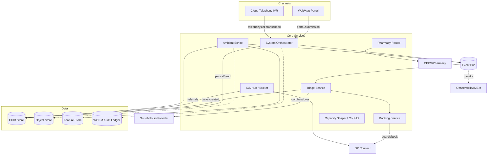
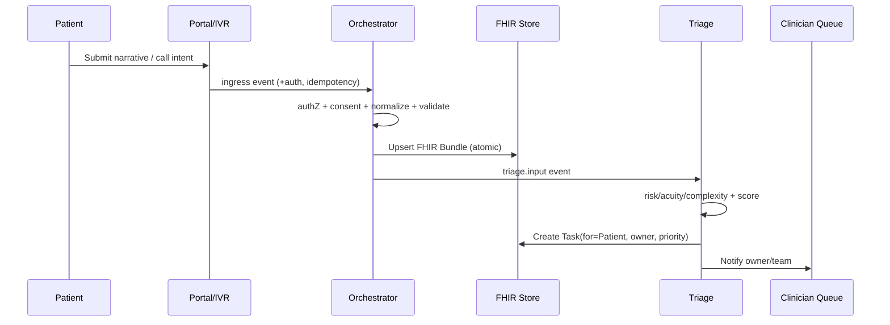
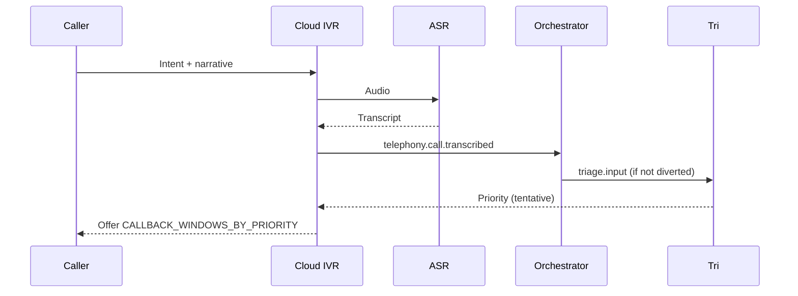
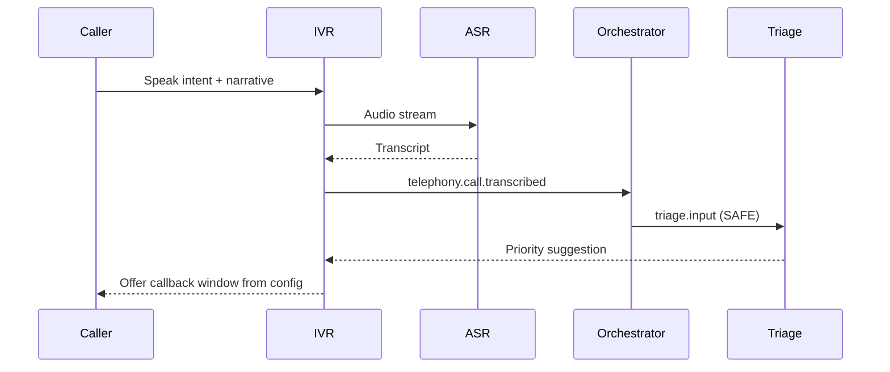
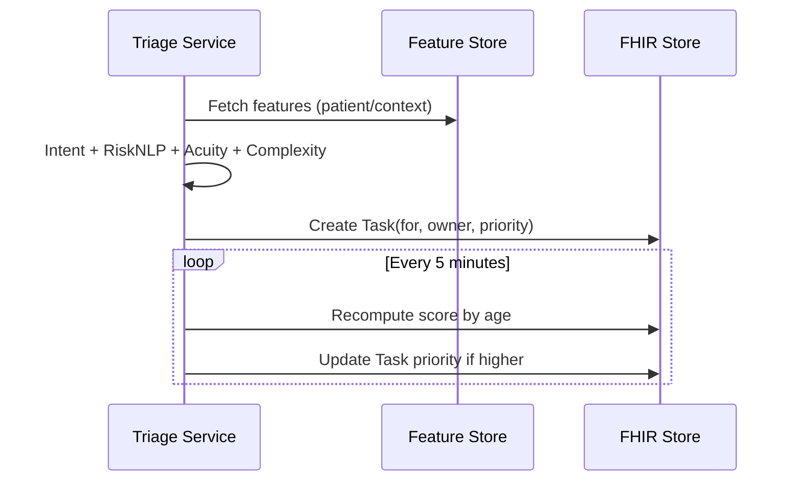
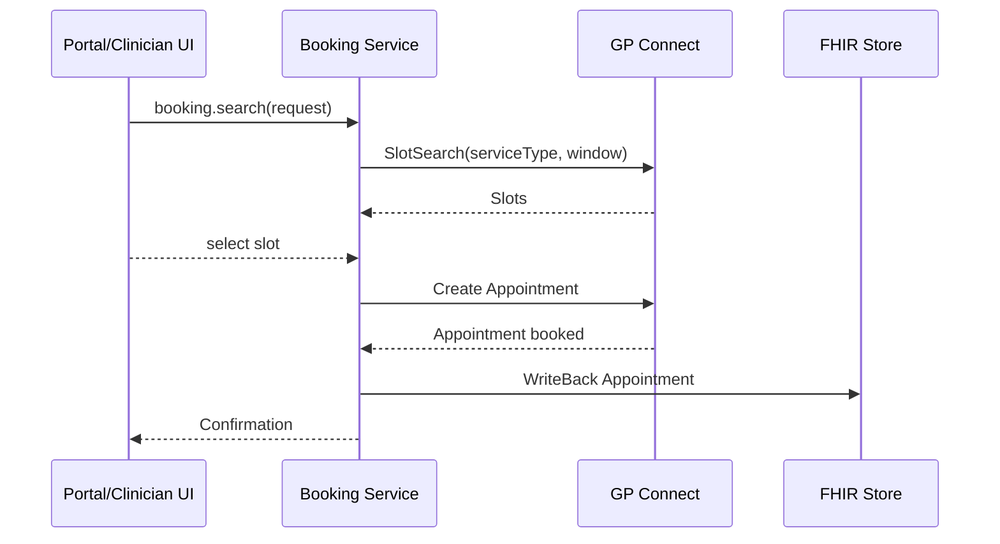
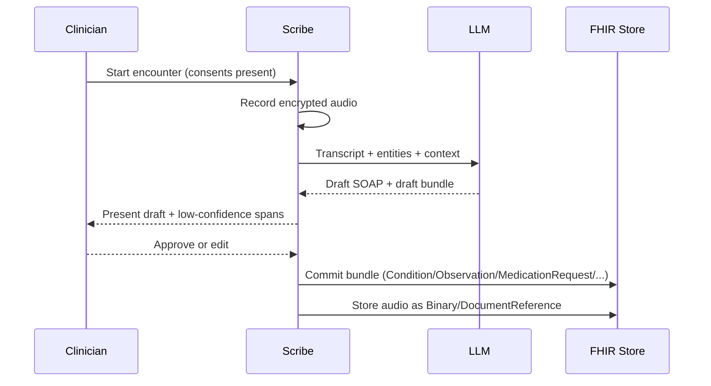
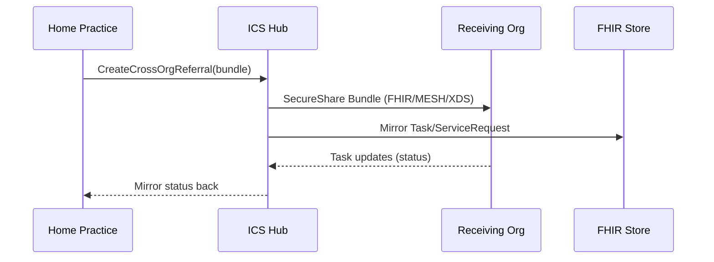
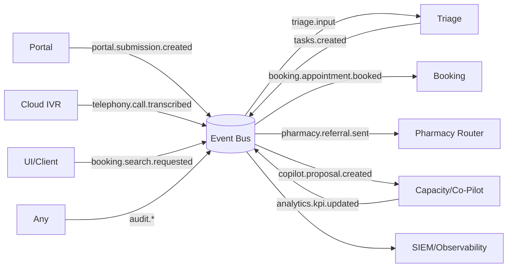

# ONECARE (Maqbool) — AI‑Powered Clinical Operating System
**Modern Access Edition (NHS & FHIR‑Native)**  
**Version 1.2 — Updated 2025**

> This document converts the attached *Maqbool_report* into a software‑ready, algorithmic Markdown specification. It preserves all essential logic and flows while structuring them into explicit initialization, processing, and output stages with concrete data models, event topics, and pseudocode suitable for implementation. It fully embeds all meaningful and important information from the report so this file is self‑contained (safe to remove the original report if needed).

---

## Table of Contents
- 0) Scope, Principles & Architecture
  - FHIR‑First Data Model, Event Bus, Data Stores, Config, Global Invariants, Coverage & Provenance
  - High‑Level Architecture (diagram)
  - Core Flows (sequence diagrams)
- 1) System Orchestrator
- 2) Access Front Door (Portal, Safety Gate, Telephony Parity)
- 3) AI Triage, SLA Aging, De‑dup
- 4) Booking (Local, PCN EA, GP Connect)
- 5) Pharmacy First Router
- 6) Capacity Shaper & Access Co‑Pilot
- 7) Ambient Scribe & Summarisation
- 8) Workflow Automation (Docs, Repeats, Recalls)
- 9) ICS Hub (Cross‑Org, Exchange, Waitlist)
- 10) Compliance & Assurance
- 11) Identity, Authorization, Consent & Safety Gates
- 12) Security, Privacy, Audit & Observability
- 13) MLOps & Governance
- 14) Failure Modes & Fallbacks
- Appendices (A–G)
- Glossary
- Developer Notes

## 0) Scope, Principles & Architecture

### 0.1 Scope
24/7 patient access with parity across **web** and **telephony**, intelligent **triage**, **enhanced access** booking via PCN hubs, **Pharmacy First** referrals, dynamic **capacity shaping**, human‑in‑the‑loop AI (**ambient scribe**), and strong **safety, security, audit, compliance** (DCB 0129/0160, DSPT).

### 0.2 FHIR‑First Data Model (single source of truth)
Core resources (non‑exhaustive): `Patient`, `Encounter`, `Observation`, `Condition`, `AllergyIntolerance`, `MedicationRequest`, `MedicationStatement`, `CarePlan`, `Task`, `ServiceRequest`, `Appointment`, `Slot`, `Schedule`, `DocumentReference`, `Binary`, `Communication`, `CommunicationRequest`, `Consent`, `AuditEvent`, `Subscription`, `Claim` (+ related coverage/response).

### 0.3 Event Bus (pub/sub topics)
`ingest.*`, `triage.*`, `scribe.*`, `portal.*`, `telephony.*`, `tasks.*`, `booking.*`, `referral.*`, `broker.*`, `pharmacy.*`, `analytics.*`, `billing.*`, `audit.*`.

### 0.4 Data Stores
- **FHIR Transactional Store** (primary clinical DB).  
- **Object Store** (binaries: audio, scans, docs via `Binary`/`DocumentReference`).  
- **Feature Store** (ML features/history).  
- **Cache** (read‑through / materialized views).  
- **WORM Audit Ledger** (immutable audit).

### 0.5 Config (per practice/PCN/ICS)
```
CORE_HOURS_START, CORE_HOURS_END
ENHANCED_ACCESS_WINDOWS              # e.g., weekday evenings + Saturdays
RED_FLAG_SET                         # symptoms/phrases triggering diversion
PRIORITY_THRESHOLDS = { STAT, URGENT, SOON, ROUTINE }
SLA_TARGETS                          # time-to-first-response per priority
HOLD_BACK_FRACTION                   # reserved slots for micro-releases
FAIRNESS_FLOORS                      # parity quotas (phone-first, languages, vulnerable groups)
PRIVACY_POLICY                       # purpose-of-use, minimization, retention
OOH_POLICY = {                       # out-of-hours behaviour
  accept_submissions: true|false,    # if true, accept and defer to next day
  patient_message: "NHS 111 / emergency guidance while we triage next day"
}
CALLBACK_WINDOWS_BY_PRIORITY = {     # example defaults derived from report
  STAT:    "immediate",
  URGENT:  "within_2h",
  SOON:    "same_day",
  ROUTINE: "initial_response_within_48h"
}
ACCESSIBILITY_AND_LANGUAGE = {       # used in search/rank + fairness
  interpreter_languages: ["en", "ur", "pa", "ar", ...],
  offer_bsl: true,
  collect_patient_prefs: ["female_clinician", "wheelchair_access", "language_preference"]
}
```

### 0.5.1 Config (YAML Example)
```yaml
core_hours:
  start: "08:00"
  end: "18:30"
enhanced_access_windows:
  - weekdays_evening
  - saturday
red_flag_set:
  - chest pain
  - severe bleeding
  - shortness of breath
priority_thresholds:
  stat: 0.9
  urgent: 0.7
  soon: 0.4
  routine: 0.0
sla_targets:
  urgent_first_contact: "PT2H"
  routine_initial_response: "P2D"
hold_back_fraction: 0.1
fairness_floors:
  telephone_min_fraction: 0.15
  interpreter_support: true
privacy_policy:
  retention_days: 3650
  minimize_data: true
ooh_policy:
  accept_submissions: true
  patient_message: "Outside core hours. For urgent needs call NHS 111, emergencies 999. We will triage next day."
callback_windows_by_priority:
  stat: immediate
  urgent: within_2h
  soon: same_day
  routine: initial_response_within_48h
accessibility_and_language:
  interpreter_languages: [en, ur, pa, ar]
  offer_bsl: true
  collect_patient_prefs: [female_clinician, wheelchair_access, language_preference]
```
### 0.6 Global Invariants
1) **FHIR‑centric** persistence; 2) **Event = side‑effect** (correlation/causation IDs);  
3) **Zero‑trust security** (authN/Z + consent for every call); 4) **Human in the loop** for clinical/irreversible actions; 5) **Safety > convenience** (red‑flag overrides).

### 0.7 Coverage & Provenance
- Incorporates all meaningful content from `Maqbool_report.docx` (Updated Version 1.2, 2025): telephony parity, red‑flag diversion, unified triage and SLA aging, Pharmacy First routing, federated booking via GP Connect, capacity shaping, ambient scribe with explicit consent, cross‑org exchange, safety/compliance, fairness, accessibility and language considerations, and operational KPIs.
- Narrative examples in the report (e.g., “urgent within 2 hours”, “routine initial response within 48 hours”) are reflected as configurable defaults under `CALLBACK_WINDOWS_BY_PRIORITY` and `SLA_TARGETS`.

### 0.8 High‑Level Architecture


### 0.9 Core Flows (Sequences)

Unified Intake → Orchestrate → Triage → Task


Telephony Parity with Callback Windows

---

## 1) System Orchestrator (Event‑Driven Core)

**Purpose:** authenticate, authorize, normalize to FHIR, transact, enrich, route, and audit every event.

### 1.1 Inputs
- Any inbound event `e` on ingress topics, with `auth`, `idempotency_key`, `payload`.

### 1.2 Algorithm
```pseudocode
Orchestrate(e):
  ctx := initContext(e)
  assert VerifySignatureAndReplayGuard(e.auth, e.id)          # zero-trust
  subj := ExtractSubject(e)                                   # patient/practitioner/system

  if !Authorize(subj.actor, e.action, subj.patient, e.scope): 
     EmitAudit("access_denied", e)
     return DENY

  if !CheckConsent(subj.patient, e.purpose, e.requested_resources):
     EmitAudit("consent_denied", e)
     return DENY

  R := NormalizeToFHIR(e.payload)                             # e.g., QuestionnaireResponse, Communication, Binary, etc.
  if !ValidateFHIRProfiles(R): 
     EmitAudit("invalid_fhir", e)
     return INVALID

  pId := ResolveMPI(R)                                        # match or create Patient
  LinkResourcesToPatient(R, pId)

  TxBegin()
    UpsertAll(R)                                              # atomic transaction (bundle)
  TxCommit()

  Enrich(R)                                                   # NLP coding, de-dup, linkages

  routes := DecideRoutes(e.topic, R)                          # publish to triage.*, booking.*, portal.notify, tasks.*, etc.
  Publish(routes)
  RecordMetrics(e, routes)
  EmitAudit("success", {e, R, routes})
  return OK
```
**Outputs:** Published events, persisted FHIR bundle, metrics, immutable audit.

Sequence (Orchestrate)


---

## 2) Access Front Door — Always‑On, Safe, Fair
Guarantees continuous access across web and phone (eliminates the "8am rush"), with safety gating and fairness.

### 2.1 Portal Uptime Guard (core‑hours compliance)
**Schedule:** Every minute per practice.  
**Goal:** Ensure portal is open within `CORE_HOURS`; display OOH banner outside.

```pseudocode
GuardPortal(practice):
  now := LocalTime(practice.tz)
  if isWithin(now, CORE_HOURS):
     if !PortalAlive(practice):
        AttemptReopen(practice.portal)
        Notify(practice.manager, "Portal reopened due to outage")
        EmitAudit("portal_reopened", practice)
  else:
     EnsureOOHBanner(practice.portal, advice="NHS 111, OOH service")
     if OOH_POLICY.accept_submissions:
        AcceptSubmissionsWithDeferral(practice.portal)       # queue for next-day triage
        ShowMessage(OOH_POLICY.patient_message)
     else:
        BlockSubmissionsWithAdvice(practice.portal)
```
**Outputs:** Portal state, incident notices, audit.

### 2.2 Urgent‑Safety Gate (red‑flag diversion)
**Trigger:** Immediately on submission (web or phone transcript).

```pseudocode
SafeguardGate(doc, patient):
  snapshot := FetchRecentContext(patient)                     # vitals, conditions, meds
  ctxdoc   := ComposeContext(doc, snapshot)

  rf := RiskNLP(ctxdoc, RED_FLAG_SET)                        # keyword/semantic red flags
  acuity := AcuityModel(ctxdoc)                               # Emergency/Urgent/Routine

  if rf.emergency || acuity == EMERGENCY:
     ShowUrgentAdvice(patient.locale)                         # 999/A&E or 111 per config
     CreateSafetyAlert(doc, patient)
     EmitAudit("urgent_diversion", {doc, patient})
     return DIVERTED
  return SAFE_TO_CONTINUE
```
**Outputs:** Patient urgent advice, Staff safety alert, audit (diverted) or pass‑through.

### 2.3 Telephony Parity (cloud IVR → same digital flow)
**Input:** Inbound call.  
**Pipeline:**
1) Cloud telephony IVR greeting and intent capture (DTMF or free speech).  
2) **ASR** → transcript (up to N sec narrative).  
3) Caller ID / identity verification → map to `Patient`.  
4) **IntentClassifier** → {clinical, medication, admin, ...}.  
5) Build `doc` (same schema as web submission).  
6) **SafeguardGate(doc)**; if **DIVERTED** → urgent advice via IVR + alert.  
7) If safe → publish to `triage.input`; offer **callback windows** based on priority (from `CALLBACK_WINDOWS_BY_PRIORITY`).  
8) End call with confirmation.

Note: Aligns with NHS cloud telephony rollout (2025) and removes the “8am rush” by converting calls into the same digital triage queue as web.

```pseudocode
HandleCall(call):
  input := CaptureIntentAndNarrative(call)
  transcript := ASR(input.audio)
  patient := ResolveCallerIdentity(call.cli, transcript.prompts)
  intent := IntentClassifier(transcript.text)
  doc := BuildStructuredDoc(patient, intent, transcript, call.meta)

  if SafeguardGate(doc, patient) == DIVERTED: return END

  Publish("triage.input", doc)
  p := tentativePriorityFromEarlySignals(doc)
  OfferCallbackWindowsFromConfig(patient, p, CALLBACK_WINDOWS_BY_PRIORITY)
  if p == STAT and IntegrationAllowsEmergencyTransfer():
     OfferImmediateTransfer(to = LocalEmergencyNumber(patient.locale))
  return END
```

Sequence (Telephony Parity)


---

## 3) AI Triage, SLA Re‑prioritisation & De‑duplication

### 3.1 Unified Triage (web + phone + walk‑in)
```pseudocode
Triage(doc):
  intent    := IntentClassifier(doc.text)
  riskFlags := RiskNLP(doc.text)                              # secondary check
  acuity    := AcuityModel(doc + patient features)
  complexity:= ComplexityModel(doc, patient)

  neededSkills := SkillExtractor(doc)
  capacity     := QueryRotaAndSchedules(neededSkills)

  # Composite priority score
  wf := riskFlags.weight
  td := TimeDecay( now() - doc.created_at )                   # 0 at creation
  cm := CapacityMismatch(neededSkills, capacity)
  score := W1*acuity + W2*wf + W3*td + W4*complexity - W5*cm

  if IsLifeThreatening(riskFlags, acuity):
     CreateSafetyAlert(doc.patient)
     EmitAudit("life_threat_override", doc)
     priorityLabel := "stat"
  else:
     priorityLabel := MapPriority(score, PRIORITY_THRESHOLDS) # stat/urgent/soon/routine

  owner := AssignBestOwner(neededSkills, capacity, doc.patient)
  task  := CreateFHIRTask(doc, owner, priorityLabel)          # status=requested, input refs, for=Patient
  Persist(task)
  NotifyOwnerQueue(owner, task)
  return task
```
**Outputs:** `Task` in clinician queue, owner/team notification, audit.

Sequence (Triage and Aging)


### 3.2 SLA Re‑prioritisation (aging)
**Schedule:** Every 5 minutes.
```pseudocode
AgeOpenTasks():
  for t in OpenTasks(status in {requested, ready}):
    score' := RecomputeScore(t.doc, age = now - t.created_at)
    newLabel := MapPriority(score', PRIORITY_THRESHOLDS)
    if Higher(newLabel, t.priority):
       UpdateTaskPriority(t, newLabel)
       NotifyOwnerQueue(t.owner, t, reason="SLA aging")
```
**Guarantees:** Monotonic escalation; audited.

### 3.3 Cross‑Channel De‑duplication
```pseudocode
Deduplicate(doc, window=W, tau=SIM_THRESHOLD):
  recents := FetchPatientRequests(doc.patient, last=W)
  for d in recents:
    if Similarity(doc, d) >= tau:
       MergeIntoTask(d.task, extraInfo=doc)    # annotate, do not create new task
       EmitAudit("dedup_merge", {doc -> d.task})
       return MERGED
  return DISTINCT
```

---

## 4) Booking — Local, PCN Enhanced Access & GP Connect Broker

### 4.1 Search & Rank
```pseudocode
SearchAndRankAppointments(request):
  intent := DetermineAppointmentType(request)                 # GP, nurse, phlebotomy...
  sources := [localPractice] + PCNPartners + Hubs             # federated sources
  S := {}
  for src in sources:
    S += FHIR_SlotSearch(src, serviceType=intent, window=request.window)

  prefs := FetchPatientPrefs(request.patient)                 # e.g., female clinician, wheelchair access, language
  for s in S:
    tt   := TravelTime(request.patient.addr, s.location)
    cont := ContinuityScore(request.patient, s.practitioner or org)
    util := UtilizationGoalWeight(s)                          # e.g., encourage EA usage
    lang := InterpreterFeasibility(prefs.language, s.location or s.site)
    access := AccessibilityFit(prefs, s.location or s.site)   # wheelchair access, BSL availability
    s.rank_score = R1*PrefScore(prefs, s) - R2*tt + R3*cont + R4*util + R5*lang + R6*access
  return TopK(sortDesc(S, by=rank_score), k=5)
```
**Outputs:** Ranked options (typically top 3–5) for patient/clinician choice.

### 4.2 Federated Book via GP Connect
```pseudocode
FederatedBook(slot, patient, reason):
  if !EligibilityCheck(slot.org, patient): return INELIGIBLE
  appt := BuildFHIRAppointment(slot, patient, reason)         # status=booked, participants
  if !GPConnectCreate(slot.org, appt): return CONFLICT_OR_FAIL
  SendConfirmation(patient, appt)                              # SMS/app/email
  WriteBackToRecord(patient, appt)
  return BOOKED(appt)
```

Sequence (Booking via GP Connect)


---

## 5) Pharmacy First Router (minor ailments deflection)

### 5.1 Condition Classification & Eligibility
```pseudocode
PharmacyFirstRoute(doc, patient):
  cond := SymptomToCondition(doc)                             # sore throat, UTI, impetigo, etc.
  if !EligibleForPharmacyFirst(cond, patient, rules):         # age/sex/severity/exclusions
     return NOT_ELIGIBLE

  options := FindNearbyPharmacies(patient.postcode, cond)     # capacity/booking availability
  slot := BestPharmacyOption(options)
  if slot == NONE:
     # Some CPCS flows accept slotless electronic referrals (pharmacy contacts patient)
     if CPCSSupportsSlotlessReferral():
        sr := CreateFHIRServiceRequest(patient, category="pharmacy-first", reason=cond)
        ok := SendCPCSReferral(nearestPharmacy(options).org, sr, doc.summary)
        NotifyPatientPharmacyReferral(patient, nearestPharmacy(options), cond)
        return BOOKED_PHARMACY(nearestPharmacy(options), sr)
     return NO_PHARMACY_SLOTS

  sr := CreateFHIRServiceRequest(patient, category="pharmacy-first", reason=cond)
  ok := SendCPCSReferral(slot.org, sr, doc.summary)
  NotifyPatientPharmacyReferral(patient, slot, cond)
  return BOOKED_PHARMACY(slot, sr)
```

Flow (Pharmacy First)
```mermaid
flowchart LR
  A[Doc + Patient] --> B{Eligible per rules?}
  B -- No --> C[Not eligible → GP]
  B -- Yes --> D[Find nearby pharmacies]
  D --> E{Slot available?}
  E -- Yes --> F[Send CPCS referral with slot]
  E -- No  --> G{Slotless referral allowed?}
  G -- Yes --> H[Send CPCS referral (slotless)]
  G -- No  --> I[Return NO_PHARMACY_SLOTS]
```
### 5.2 Outcome Write‑back
- Listen for pharmacy outcome → ingest as `Observation` / `Condition` / `MedicationRequest` + update/close original `Task`.  
- If escalated by pharmacist → create **urgent** `Task` for GP.

---

## 6) Capacity Shaper & Access Co‑Pilot

### 6.1 Forecasting & Micro‑Releases
**Schedule:** ~ every 15 minutes.
```pseudocode
ShapeCapacity():
  telem := CollectTelemetry()                     # queue depth, arrivals/hr, no-shows, staffing
  forecast := ShortHorizonForecast(telem, H=4h)
  need  := NeedMix(telem.openTasks + forecast)    # urgent/soon/routine/admin
  supply:= SupplyMix(currentSlots, staffRota)
  delta := need - supply

  if Significant(delta, eps):
     ReleaseHeldBackSlots(HOLD_BACK_FRACTION, target=delta)   # convert slot types if needed
     RebalanceTemplatesSafely()                               # preserve urgent floor
     EmitAudit("micro_release", delta)
```
### 6.2 Access Co‑Pilot (human‑in‑the‑loop optimizer)
```pseudocode
AccessCoPilot():
  state := ObserveKPIsAndRisks()                  # SLA breach risk, utilization, continuity, fairness
  actions := {
    SwapSlotTypes, ExtendCallbacks, ReassignStaff,
    FederateToPCN, IncreasePharmacyRouting, ...
  }
  best := NONE; bestU := -inf
  for a in actions:
    if GuardrailsOk(a, state):
       U := ProjectUtility(a, state)              # expected KPI improvement
       if U > bestU: best := a; bestU := U

  if best != NONE:
     ProposeToManager(best, rationale, projectedImpact)
     if ManagerApproves(best):
        Apply(best); EmitAudit("copilot_apply", best)
```
**Outputs:** Released slots, template adjustments, approved operational changes.

Flow (Capacity Shaping)
```mermaid
flowchart LR
  T[Telemetry: arrivals, queue, no‑shows, staffing] --> F[Short‑horizon forecast]
  F --> N[Need mix]
  T --> S[Supply mix]
  N --> D[Delta (need - supply)]
  S --> D
  D -->|Significant?| R[Micro‑releases / template rebalance]
  R --> A[Audit micro_release]
```

---

## 7) Ambient Scribe & Summarisation (safety‑first)

### 7.1 Capture → Draft → Commit
```pseudocode
AmbientScribe(encounter):
  if !(Consent(patient) && Consent(clinician)): return DISABLED

  audio := RecordEncryptedAudio(encounter)                    # FHIR Binary/DocumentReference
  transcript := ASR_Diarize(audio)                            # speaker turns
  entities := ClinicalNLP(transcript)                         # SNOMED tagging, vitals
  context := PullRecentContext(encounter.patient)

  draft := LLM_SoAP(transcript, entities, context)            # SOAP(summary)
  bundleDraft := DraftFHIRBundleFromSummary(draft)            # Condition, Observation, MedicationRequest, CarePlan, DocumentReference

  presentToClinician(draft, highlights=lowConfidenceSpans)
  if ClinicianApprovesEdits(draft):
     Commit(bundleDraft)                                      # finalize into FHIR store
     EmitAudit("scribe_committed", {encounter, model_ver})
  else:
     SaveEditsOrFallbackManual()
```
**Outputs:** Finalised clinical note + structured entries; immutable audit.  
**Fallbacks:** Provide raw transcript or template if AI unavailable.

Sequence (Ambient Scribe)


---

## 8) Workflow Automation (Docs, Repeats, Recalls)

### 8.1 Document Automation (letters, PDFs, faxes)
```pseudocode
OnDocumentReferenceCreated(docRef):
  if IsImageOrScanned(docRef): text := OCR(docRef)
  dtype := ClassifyDocument(text)                              # discharge, consultant letter, labs...
  key := ExtractKeyData(dtype, text)                           # dx/procedures/med changes/follow-up
  patient := ResolveFromDoc(text or metadata)
  suggestions := SuggestActionsFromKey(dtype, key)
  tasks := CreateTasksAndDrafts(patient, suggestions)
  RouteTasksByType(tasks)
```
### 8.2 Repeat Prescriptions (safety‑first, human sign‑off)
```pseudocode
HandleRepeatRequest(req, patient):
  if !OnRepeatList(req.med) || ExpiredAuthorization(req.med): return ROUTE_TO_REVIEW
  if TooEarly(req) || MonitoringDue(patient, req.med):        return ROUTE_TO_REVIEW
  if AllergyOrInteractions(patient, req.med) or AbnormalRecentLabs(patient, req.med):
     return ROUTE_TO_GP

  draft := DraftMedicationRequest(req, patient)
  task := CreateAuthTask(draft, role in {Pharmacist, GP})
  OnHumanSignOff(task): IssueEPSPrescription(draft)
```
### 8.3 LTC Recalls (demand smoothing)
```pseudocode
NightlyLTCJob():
  cohorts := BuildOverdueCohorts()                             # diabetes/asthma/COPD/...
  plan := SpreadOverWeeks(cohorts, clinicCapacity)
  for p in plan:
    AutoScheduleOrInvite(p.patient, p.clinic, p.week)
    CreateRecallTasks(p)
```

---

## 9) ICS Hub — Cross‑Org Tasks, Access Exchange, Smart Waitlist

### 9.1 Cross‑Org Referral & Task Mirrors
```pseudocode
CreateCrossOrgReferral(patient, fromOrg, toOrg, reason, attachments):
  sr := FHIR.ServiceRequest(patient, reason, toOrg)
  t  := FHIR.Task(assignee=toOrg, basedOn=sr)
  bundle := Bundle(sr, t, attachments)
  SecureShare(toOrg, bundle)                                   # FHIR, MESH/XDS, etc.
  SubscribeTaskUpdates(t)                                      # mirror status back
  return t
```
### 9.2 Access Exchange (PCN/ICS marketplace)
```pseudocode
AccessExchange():
  spare := AggregateOpenSlots(network, horizon=48h)
  waiters := CollectWaitingPatientsWithPriorityAndPrefs()
  matches := Match(waiters, spare, criteria=[need, continuity, distance, fairness])
  for (w, s) in matches:
     FederatedBook(s, w.patient, reason=w.reason)
     NotifyHomePractice(w.patient, s)
```
### 9.3 Smart Waitlist (auto‑fill cancellations)
```pseudocode
OnAppointmentCancelled(slot):
  candidates := FilterWaitlistByTypeAndFeasibility(slot)
  ordered := Rank(candidates, by=[need, continuityToClinician(slot), distance, fairness])
  OfferSequentialOrBatch(ordered, slot, ttl=30min)
  OnFirstAccept(): ConfirmBooking(slot, patient)
  ExpireOthers()
  if StartImminent(slot, within=15min) and NoAccepts():
     MarkAsOpenForWalkInsOrLastMinuteCalls(slot)
```

Sequence (Cross‑Org Referral)


---

## 10) Compliance & Assurance (contracts, KPIs, reports)

### 10.1 Live KPIs (examples)
- **Portal Uptime (core hours)**  
- **Median Time‑to‑First‑Response** (by category)  
- **Callback SLA Hit Rate** (STAT/URGENT/SOON/ROUTINE)  
- **Enhanced Access Utilisation**  
- **Pharmacy Diversion Rate**  
- **Fairness Floors Met** (parity across channels/cohorts)  
- **Continuity Score**

Notes: Example defaults from the report include URGENT contact within 2 hours and ROUTINE initial response within 48 hours; these feed SLA hit‑rate tracking and the aging/escalation logic.

### 10.2 Reporting
- **Hourly dashboards:** practice / PCN / ICS views.  
- **Monthly Access Assurance Pack:** trends, breaches, mitigations, Co‑Pilot decisions, signatures.  

---

## 11) Identity, Authorization, Consent & Safety Gates

### 11.1 Authorization = RBAC + Relationship + ABAC + Purpose‑of‑Use
```pseudocode
Authorize(actor, action, subject, scope):
  if !RBAC(actor.role, action): return false
  if !HasRelationshipOrBreakGlass(actor, subject.patient): return false
  if !ABAC_OK(actor, subject, scope): return false           # sensitivity, time, device, location
  return true
```
### 11.2 Consent & Break‑Glass
```pseudocode
CheckConsent(patient, purpose, resources):
  rules := FetchActiveFHIRConsent(patient)
  return EvaluatePurposeAndScopes(rules, purpose, resources)
```
Break‑glass grants emergency access w/ reason, heavy audit, post‑hoc review.

### 11.3 Clinical Safety Gates
- **Red‑Flag diversion** (pre‑triage).  
- **Human confirmation** of AI outputs (triage assignments, patient advice, scribe).  
- **Communication guardrails** (plain language, safety‑netting).  
- Safety case & hazard log (DCB0129/0160).

### 11.4 Communication Guardrails (patient‑facing advice)
```pseudocode
ComposePatientAdvice(draft, locale):
  msg := UsePlainLanguage(draft, reading_age=9)
  msg := AvoidDefinitiveDiagnosis(msg)                        # suggest possibilities, not certainties
  msg := AddSafetyNetting(msg, "If symptoms worsen, contact us or emergency services.")
  msg := LocalizeUrgentNumbers(msg, locale)                   # e.g., 999/A&E, NHS 111
  return msg
```

---

## 12) Security, Privacy, Audit & Observability

### 12.1 Security & Minimization
- **Encryption** at rest (tenant‑scoped keys) and in transit (TLS).  
- **Zero‑trust** between services; least privilege.  
- **Field redaction / query rewriting** per role/consent.  
- **Data minimization & retention**; analytics de‑identification.  
- **Regular penetration testing** and full **DSPT** compliance.

### 12.2 Immutable Audit (WORM) + SIEM
```pseudocode
EmitAudit(action, obj):
  rec := { action, actor, subject, resources, ts, outcome, model_ver? }
  AppendWORM(rec); StreamToSIEM(rec); AnomalyDetect(rec)
```
### 12.3 Observability & Resilience
- SLOs: triage p95 < 2s; scribe draft < 60s; portal p99 < 300ms.  
- Backpressure & circuit breakers; graceful degradation (rule‑based fallbacks).  
- Health dashboards & alerting; cache for reads; queues for writes during connector outages.  
- All events carry correlation and causation IDs end‑to‑end for traceability across services and audit.

---

## 13) MLOps & Governance

### 13.1 Lifecycle
```pseudocode
ModelLifecycle(model):
  data := CurateDeidentifiedTrainingData(FeatureStore, window=6-12m)
  v := Train(model, data)
  eval := Evaluate(v, sets=[in-domain, OOD, fairness]); if !PassSafety(eval): STOP
  Register(v, model_card, lineage, metrics)
  CanaryDeploy(v, pct=5%) -> Monitor(latency, agreement, outcomes, bias, drift)
  if Stable(): PromoteTo100% else: Rollback()
```
### 13.2 Explainability & Feedback
- Log inputs/outputs (hashed identifiers), prompt/response archives for LLMs.  
- SHAP/LIME explanations for predictive models.  
- Clinician disagreement feedback loops; outcome‑based learning; fairness monitoring.

---

## 14) Failure Modes & Fallbacks (fail‑safe)

- **ASR down:** route to receptionist/voicemail; store audio; later transcription; manual notes UI.  
- **LLM unavailable:** show raw transcript; template summaries; rule‑based triage.  
- **Connector outage (e.g., GP Connect):** cache reads, queue writes, inform users; retry on recovery.  
- **High‑risk with no capacity:** auto‑escalate to on‑call/PCN/OoH; advise patient to 111/A&E; management alert.  
- **Portal down in hours:** auto‑restart, incident alert, contingency message; recorded in uptime KPI.  
- **Infra/data incidents:** backups, failover; emergency mode for demand surges.
- **Mass demand surge (e.g., winter pressures/pandemic):** broadcast delay messaging, expand callback windows per `CALLBACK_WINDOWS_BY_PRIORITY`, adjust templates while preserving urgent floors; notify PCN/ICS for mutual aid.
 - **OOH handover:** when outside core hours and high‑risk cases occur, perform warm handover to local out‑of‑hours provider (with consent or emergency basis) and inform patient with instructions (111/AE as appropriate).

---

## Appendix A — Priority Mapping (monotonic)

```pseudocode
MapPriority(score):
  if score >= S_STAT:   return "stat"
  if score >= S_URGENT: return "urgent"
  if score >= S_SOON:   return "soon"
  return "routine"
```
**Constraints:**  
1) Higher clinical acuity never lowers score.  
2) Life‑threatening → **STAT** override.  
3) Time since submission only increases priority (aging).

---

## Appendix B — Continuity & Fairness‑Aware Assignment
```pseudocode
AssignBestOwner(neededSkills, capacity, patient):
  candidates := FilterBySkills(capacity, neededSkills)
  best := argmax_c in candidates of (
    α*Availability(c) + β*ResolutionRate(c, issueType)
  + γ*Continuity(patient, c)
  - δ*Distance(patient, c.site) 
  + ζ*FairnessBoost(patient.needs, c.capabilities)
  )
  return best
```

---

## Appendix C — Minimal API Surface (illustrative)

```
POST /portal/submissions            -> creates FHIR QuestionnaireResponse/Communication; emits triage.input
GET  /clinician/tasks               -> query FHIR Task for team/owner/status
POST /booking/search                -> federated search (Slot search)
POST /booking/federated             -> GP Connect book Appointment
POST /pharmacy/route                -> Pharmacy First evaluation + referral
POST /copilot/proposal/apply        -> manager approval to apply action
GET  /compliance/kpis               -> KPI dashboard feed
```
All endpoints enforce authZ + consent; outputs filtered by policy.

---

## Appendix D — Configuration Summary
- **Hours & windows:** `CORE_HOURS_*`, `ENHANCED_ACCESS_WINDOWS`  
- **Safety:** `RED_FLAG_SET`, `PRIORITY_THRESHOLDS`, `SLA_TARGETS`  
- **Capacity:** `HOLD_BACK_FRACTION`  
- **Equity:** `FAIRNESS_FLOORS`  
- **Privacy & retention:** `PRIVACY_POLICY`

---

## Appendix E — Event Topics (examples)
- `portal.submission.created`, `telephony.call.transcribed`, `triage.input`, `tasks.created`  
- `booking.search.requested`, `booking.appointment.booked`, `pharmacy.referral.sent`  
- `copilot.proposal.created`, `copilot.proposal.approved`, `analytics.kpi.updated`, `audit.*`  
- `ooh.handover.sent`, `ooh.handover.ack` (out‑of‑hours warm handover lifecycle)

Event Topics Map (illustrative)


---

## Appendix F — Data Contracts (selected FHIR elements)

**Task**  
`status`, `priority`, `for(Reference:Patient)`, `owner(Reference:Practitioner/Org)`, `input(References)`, `authoredOn`, `reasonCode`, `basedOn`.  

**Appointment**  
`status`, `slot(Reference:Slot)`, `start`, `end`, `participant[Patient, Practitioner, Location/Service]`, `reasonCode/description`.  

**ServiceRequest**  
`status`, `intent`, `subject(Patient)`, `code/category`, `reasonCode`, `authoredOn`, `requester`, `performer`.  

**DocumentReference/Binary**  
`type`, `subject`, `content(attachment:url/mediaType/hash)`, `context(encounter)`.  

**Consent**  
`status`, `scope(purpose)`, `provision(type, actor, action, data, purpose)`.

---

## Appendix G — SLOs & Alerts (examples)
- **Triage** p95 < 2s; alert if p95 > 2s for 5m.  
- **Scribe draft** < 60s; alert if queue backlog > N.  
- **Portal** p99 < 300ms; uptime ≥ 99.9% core hours.  
- **Audit** end‑to‑end correlation coverage = 100%.

---

## Sources (from original report)
NHS Enhanced Access DES; Pharmacy First service; GP Connect Appointment Management; 24/7 digital access exemplars; NHS guidance on AI ambient scribing; NHS Clinical Safety Standard DCB0129/DCB0160; continuity of care and access equity considerations.

---

## Glossary
- FHIR: HL7 Fast Healthcare Interoperability Resources standard
- GP Connect: NHS interface for cross‑org appointment booking and data access
- CPCS: Community Pharmacist Consultation Service (Pharmacy First referrals)
- PCN: Primary Care Network
- OOH: Out‑of‑hours provider/service
- SIEM: Security Information and Event Management system
- WORM: Write Once Read Many (immutable storage)

## Developer Notes
- Pseudocode convention: TitleCase functions with explicit inputs/outputs; side‑effects publish to `Event Bus` and persist to `FHIR` atomically where relevant.
- All patient data is FHIR‑first; binaries are stored via `Binary`/`DocumentReference` with hash and mediaType.
- Every externally visible change emits an event and an immutable audit record with correlation/causation IDs.
- Safety gates precede AI decisions; any AI suggestion with clinical impact requires human confirmation.
- Config is environment/tenant scoped; defaults shown in the YAML example should be overridden per practice/PCN.
- Use the Event Topics Map and Sequences to locate producer/consumer responsibilities quickly when implementing services.
