# ONECARE (Maqbool) — AI‑Powered Clinical Operating System
---

## Table of Contents
- 0) Scope, Principles & Architecture
  - FHIR‑First Data Model, Event Bus, Data Stores, Config, Global Invariants, Coverage & Provenance
  - High‑Level Architecture (diagram)
  - Core Flows (sequence diagrams)
- 1) System Orchestrator
- 2) Access Front Door (Portal, Safety Gate, Telephony Parity)
- 3) AI Triage, SLA Aging, De‑dup
- 4) Booking (Search, Assisted, GP Connect)
- 5) Pharmacy First Router
- 6) Capacity Shaper & Access Co‑Pilot
- 7) Ambient Scribe & Summarisation
- 8) Workflow Automation (Docs, Repeats, Recalls)
- 9) ICS Hub (Cross‑Org, Exchange, Waitlist)
- 10) Compliance & Assurance
- 11) Identity, Authorization, Consent & Safety Gates
- 12) Security, Privacy, Audit & Observability
- 13) MLOps & Governance
- 14) Failure Modes & Fallbacks
- Appendices (A–G)
- Glossary
- Implementation Notes — Send Document Rollout
- Developer Notes

## 0) Scope, Principles & Architecture

### 0.1 Scope
24/7 patient access with parity across **web** and **telephony**, intelligent **triage**, **enhanced access** booking via PCN hubs, **Pharmacy First** referrals, dynamic **capacity shaping**, human‑in‑the‑loop AI (**ambient scribe**), and strong **safety, security, audit, compliance** (DCB 0129/0160, DSPT).

### 0.2 FHIR‑First Data Model (single source of truth)
Core resources (non‑exhaustive): `Patient`, `Encounter`, `Observation`, `Condition`, `AllergyIntolerance`, `MedicationRequest`, `MedicationStatement`, `CarePlan`, `Task`, `ServiceRequest`, `Appointment`, `Slot`, `Schedule`, `DocumentReference`, `Binary`, `Communication`, `CommunicationRequest`, `Consent`, `AuditEvent`, `Subscription`, `Claim` (+ related coverage/response).

### 0.3 Event Bus (pub/sub topics)
`ingest.*`, `triage.*`, `scribe.*`, `portal.*`, `telephony.*`, `tasks.*`, `booking.*`, `referral.*`, `broker.*`, `pharmacy.*`, `analytics.*`, `billing.*`, `audit.*`.

### 0.4 Data Stores
- **FHIR Transactional Store** (primary clinical DB).  
- **Object Store** (binaries: audio, scans, docs via `Binary`/`DocumentReference`).  
- **Feature Store** (ML features/history).  
- **Cache** (read‑through / materialized views).  
- **WORM Audit Ledger** (immutable audit).

### 0.5 Config (per practice/PCN/ICS)
```
CORE_HOURS_START, CORE_HOURS_END
ENHANCED_ACCESS_WINDOWS              # e.g., weekday evenings + Saturdays
RED_FLAG_SET                         # symptoms/phrases triggering diversion
PRIORITY_THRESHOLDS = { STAT, URGENT, SOON, ROUTINE }
SLA_TARGETS                          # time-to-first-response per priority
HOLD_BACK_FRACTION                   # reserved slots for micro-releases
FAIRNESS_FLOORS                      # parity quotas (phone-first, languages, vulnerable groups)
PRIVACY_POLICY                       # purpose-of-use, minimization, retention
OOH_POLICY = {                       # out-of-hours behaviour
  accept_submissions: true|false,    # if true, accept and defer to next day
  patient_message: "NHS 111 / emergency guidance while we triage next day"
}
CALLBACK_WINDOWS_BY_PRIORITY = {     # example defaults derived from report
  STAT:    "immediate",
  URGENT:  "within_2h",
  SOON:    "same_day",
  ROUTINE: "initial_response_within_48h"
}
ACCESSIBILITY_AND_LANGUAGE = {       # used in search/rank + fairness
  interpreter_languages: ["en", "ur", "pa", "ar", ...],
  offer_bsl: true,
  collect_patient_prefs: ["female_clinician", "wheelchair_access", "language_preference"]
}
SAFETY_GATE = {                      # transformer-based pre-triage safety gate
  MODEL_NER: "bioclinicalbert",     # bio/clinical BERT variant for NER
  MODEL_CLASSIFIER: "medalpaca-sm", # emergency classifier model id
  MULTILINGUAL_MODE: "native",      # native | translate
  TRANSLATE_ENGINE: "none",         # if MULTILINGUAL_MODE=translate
  RED_FLAG_THRESHOLD: 0.65,          # entity-based risk threshold
  EMERGENCY_CONFIDENCE: 0.70,        # classifier confidence for emergency
  ACUITY_MODEL: "xgboost",          # ensemble model for acuity
  ACUITY_THRESHOLD_EMERGENCY: 0.75,  # emergency cut-off
  TIMEOUT_MS: 800,                   # fail-fast budget for gate
  FALLBACK: "rules"                  # rules | none
}
SCRIBE = {                           # ambient scribe controls
  ENABLED: true,
  ASR_MODEL: "whisper-large-v3-medical",
  ASR_DIARIZATION: true,
  LLM_MODEL: "medpalm2",
  MAX_SUMMARY_TOKENS: 2048,
  UNCERTAINTY_HIGHLIGHT: true,
  REQUIRE_CLINICIAN_APPROVAL: true,
  STORE_AUDIO: "binary",             # Binary/DocumentReference
  TERMINOLOGY: { condition: "SNOMED-CT", medication: "dm+d" },
  TIMEOUT_MS: 30000,
  FALLBACK_MODE: "transcript"        # transcript | template | none
}
MESSAGING_SEND_DOCUMENT = {          # GP Connect Messaging (Send Document v2.0)
  MESH: {
    WORKFLOW_ID: "GPCONNECT_SEND_DOCUMENT",
    ACK_WORKFLOW_ID: "GPCONNECT_SEND_DOCUMENT_ACK",
    SENDER_MAILBOX: "<MESH ID>",     # site-specific MESH mailbox
    ACK_TIMEOUT_MINUTES: 30,
    MAX_RETRIES: 5,
    BACKOFF_SCHEDULE_MINUTES: [1, 5, 15, 60, 180]
  },
  PDS_LOOKUP: true,
  PDF_MAX_MB: 10
}
FEATURE_FLAGS = {
  GP_CONNECT_BOOKING: false          # lock autobooking behind a feature flag
}
```

### 0.5.1 Config (YAML Example)
```yaml
core_hours:
  start: "08:00"            # Core hours start (local time)
  end: "18:30"              # Core hours end (local time)
enhanced_access_windows:
  - weekdays_evening
  - saturday
red_flag_set:
  - "chest pain"
  - "shortness of breath"
  - "severe bleeding"
  - "unresponsive"
  - "suicidal ideation"
priority_thresholds:
  stat: 0.9
  urgent: 0.7
  soon: 0.4
  routine: 0.0
sla_targets:
  stat_immediate: "PT0M"               # STAT: immediate action (no delay)
  urgent_first_contact: "PT2H"         # URGENT: within 2 hours
  soon_same_day: "PT12H"               # SOON: within 12 hours (same working day)
  routine_initial_response: "P2D"      # ROUTINE: within 2 days
hold_back_fraction: 0.10               # 10% slots initially held for urgent/micro-release
fairness_floors:
  telephone_min_fraction: 0.15         # At least 15% of appts for telephone requests
  interpreter_support: true            # Interpreter/language support available
privacy_policy:
  retention_days: 3650                 # Retain audit data ~10 years
  minimize_data: true                  # Store only necessary data
ooh_policy:
  accept_submissions: true             # Allow OOH submissions (deferred triage)
  patient_message: >
    Outside core hours. For urgent medical help, contact NHS 111 (24/7)
    or call 999 for emergencies. You may submit your issue now and we
    will review it when we re-open.
callback_windows_by_priority:
  stat: "immediate"
  urgent: "within_2h"
  soon: "same_day"
  routine: "within_48h"
accessibility_and_language:
  interpreter_languages: ["en", "ur", "pa", "pl", "ar"]
  offer_bsl: true
  collect_patient_prefs: ["female_clinician", "wheelchair_access", "language_preference"]
safety_gate:
  model_ner: "bioclinicalbert"
  model_classifier: "medalpaca-sm"
  multilingual_mode: "native"
  translate_engine: "none"
  red_flag_threshold: 0.65
  emergency_confidence: 0.70
  acuity_model: "xgboost"
  acuity_threshold_emergency: 0.75
  timeout_ms: 800
  fallback: "rules"
triage:
  score_weights:
    acuity: 1.0
    risk: 0.5
    complexity: 0.2
    time: 0.5
    capacity: 0.2
  aging_interval: "PT5M"
  sim_threshold: 0.8
  dedup_window: "PT72H"
provider_assignment:
  weights:
    availability: 1.0
    workload: 1.0
    continuity: 0.5
    resolution_rate: 0.2
    distance: 0.2
    fairness: 0.5
telephony:
  ivr_intent_classifier: "default"
  max_callback_retries: 3
  emergency_transfer_enabled: true
ambient_scribe:
  enabled: true
  asr_model: "whisper-large-v3-medical"
  asr_diarization: true
  llm_model: "medpalm2"
  max_summary_tokens: 2048
  uncertainty_highlight: true
  require_clinician_approval: true
  store_audio: "binary"                # Binary/DocumentReference
  terminology:
    condition: "SNOMED-CT"
    medication: "dm+d"                  # UK meds coding
  timeout_ms: 30000
  fallback_mode: "transcript"
messaging:
  send_document:
    mesh:
      workflow_id: "GPCONNECT_SEND_DOCUMENT"
      ack_workflow_id: "GPCONNECT_SEND_DOCUMENT_ACK"
      sender_mailbox: "MESH1234"        # site-specific MESH mailbox ID
      ack_timeout_minutes: 30
      max_retries: 5
      backoff_schedule: ["PT1M", "PT5M", "PT15M", "PT1H", "PT3H"]
    pds_lookup: true
    pdf_max_mb: 10
feature_flags:
  gp_connect_booking: false             # enable when national booking API ready
security:
  audit_all_events: true
  worm_audit_store: true
  auth_required: true
  encryption: "TLS1.2+"
observability:
  metrics_collection: true
  slo:
    triage_p95_ms: 2000
    scribe_draft_p95_s: 60
    portal_core_uptime: 0.999
    audit_coverage: 1.0
  alerts:
    triage_latency_breach:
      threshold_ms: 2000
      duration: "PT5M"
    scribe_backlog:
      threshold_queue_length: 5
      duration: "PT1M"
    portal_downtime:
      threshold_minutes: 5
    fairness_monitor:
      telephone_fraction_floor: 0.15
      check_window: "P1D"
```
### 0.5.2 Config Hierarchy & Overrides
- Layers: global → ICS → PCN → practice (most specific wins).
- Merge: maps shallow-merge; arrays replace unless marked additive.
- Safety floors/ceilings: emergency thresholds, priority floors, and audit requirements may only become stricter downstream.
- Provenance: defaults derived from “AI Triage System Configuration for NHS GP Deployment”; practices can override within allowed bounds.

### 0.6 Global Invariants
1) **FHIR‑centric** persistence; 2) **Event = side‑effect** (correlation/causation IDs);  
3) **Zero‑trust security** (authN/Z + consent for every call); 4) **Human in the loop** for clinical/irreversible actions; 5) **Safety > convenience** (red‑flag overrides).

### 0.7 Coverage & Provenance
- Incorporates content from `AI Triage System Configuration for NHS GP Deployment.pdf` (NHS GP baseline, thresholds, model choices) and `Maqbool_report.docx` (Updated Version 1.2, 2025): telephony parity, red‑flag diversion, unified triage and SLA aging, Pharmacy First routing, federated booking via GP Connect, capacity shaping, ambient scribe with explicit consent, cross‑org exchange, safety/compliance, fairness, accessibility and language considerations, and operational KPIs.
- Narrative examples (e.g., “urgent within 2 hours”, “routine initial response within 48 hours”) are reflected as configurable defaults under `CALLBACK_WINDOWS_BY_PRIORITY` and `SLA_TARGETS`.

### 0.8 High‑Level Architecture
```mermaid
graph TD
  subgraph Channels
    P[Web/App Portal]
    T[Cloud Telephony IVR]
  end

  subgraph Core Services
    O[System Orchestrator]
    TR[Triage Service]
    BK[Booking Service]
    PH[Pharmacy Router]
    CS[Capacity Shaper / Co-Pilot]
    SC[Ambient Scribe]
    ICS[ICS Hub / Broker]
  end

  subgraph Data
    FHIR[(FHIR Store)]
    OBJ[(Object Store)]
    FEAT[(Feature Store)]
    AUD[(WORM Audit Ledger)]
  end

  EB[(Event Bus)]
  OBS[Observability/SIEM]
  GP[GP Connect Messaging (Send Document)]
  CPCS[CPCS/Pharmacy]
  OOH[Out-of-Hours Provider]
  STAFF[Staff action in GP system (assisted)]

  P -->|portal.submission| O
  T -->|telephony.call.transcribed| O
  O -->|persist/read| FHIR
  O --> EB
  EB --> TR
  TR -->|tasks.created| FHIR
  TR --> BK
  BK -->|search/book| GP
  BK --> STAFF
  PH --> CPCS
  SC --> EB
  ICS --> GP
  ICS -->|referrals| FHIR
  O -.-> AUD
  EB -.monitor.-> OBS
  TR -->|ooh.handover| OOH
  SC --> FHIR
  SC --> FEAT
  SC -.-> OBJ
```


### 0.9 Core Flows (Sequences)

Unified Intake → Orchestrate → Triage → Task
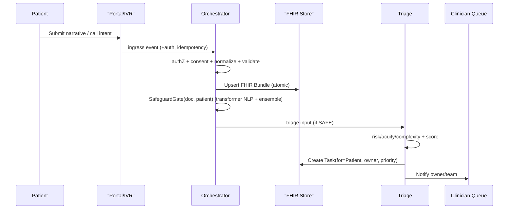

Telephony Parity with Callback Windows
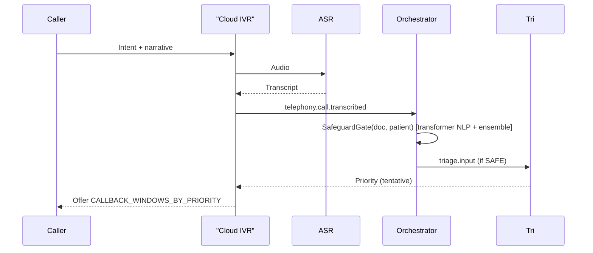
---

Guided Narrative Helper (Portal Narrative, LLM‑assisted)
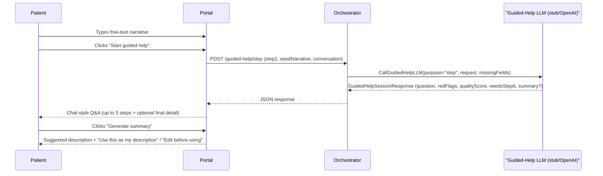

```pseudocode
GuidedHelpSession(request: GuidedHelpSessionRequest):
  # 1) Validate + practice guardrail
  assert request.practiceId == Config.practice_id
  validateAgainstSchema(request)                        # JSON Schema (request)

  # 2) Derive coverage/missing fields
  axes := ["onset", "location", "severity", "otherSymptoms"]
  covered := {}                                        # axes with useful answers
  for msg in request.conversation or []:
    if msg.role != "user": continue
    for tag in msg.fieldTags or []:
      if tag in axes: covered.add(tag)
  if covered.empty():
    covered := InferCoveredFromStep(request.stepId)    # compatibility fallback

  missing := axes \ covered                            # hint to LLM which axis to ask about next

  # 3) Quality & low‑signal heuristics
  userText := JoinUserTexts(request.seedNarrative, request.conversation)
  wordCount := CountWords(userText)
  diversity := UniqueWordRatio(userText)
  lowSignalReasons := DetectLowSignalPhrases(userText) # "idk", "n/a", "nothing", etc.

  qualityScore := 0.0
  qualityScore += CoverageComponent(covered.size)      # +0.0–0.4
  qualityScore += LengthComponent(wordCount)           # +0.0–0.3
  qualityScore += DiversityComponent(diversity)        # +0.0–0.2
  qualityScore := Clamp(qualityScore, 0.0, 1.0)

  # 4) Red‑flag classifier (inline safety net)
  redFlags := DetectHighRiskPhrases(userText)          # chest_pain, shortness_of_breath, etc.
  if redFlags != ["none"]:
    # Stop guided help; UI shows neutral emergency advice and disables summary.
    return StubGuidedHelpResponse(request, {
      stepId: request.stepId,
      redFlags,
      proceedToSummary: false,
      needsStep6: false,
    })

  # 5) LLM‑assisted follow‑up (single question)
  if Env.GUIDED_HELP_LLM_MODE == "openai":
    llmResponse := CallOpenAiChat({
      endpoint: Env.LLM_API_ENDPOINT,
      apiKey: Env.LLM_API_KEY,
      model: Env.LLM_MODEL,                  # e.g., gpt‑4o
      systemPrompt: BuildGuidedHelpSystemPrompt(request.locale),
      developerPrompt: BuildStepDeveloperPrompt(request.stepId, missing, maxSteps=5),
      inputPayload: Redacted(request, covered, missing, qualityScore, lowSignalReasons),
      # payload excludes identifiers; narrative text is truncated
    })
    candidate := ParseJson(llmResponse.content)        # model returns JSON only
    if validateAgainstSchema(candidate):               # JSON Schema (response)
      response := MergeWithDefaults(candidate, {
        sessionId: request.sessionId,
        stepId: request.stepId,
        redFlags: ["none"],
        proceedToSummary: false,
        needsStep6: false,
        telemetryMeta: { llmProvider: "openai", llmModel: Env.LLM_MODEL },
      })
    else:
      Log("guided_help.llm.response_validation_failed", validationErrors)
      response := StubGuidedHelpResponse(request, { covered, missing, qualityScore })
  else:
    response := StubGuidedHelpResponse(request, { covered, missing, qualityScore })

  # 6) Conditional final detail (Step 6) gate
  if request.stepId == "step5":
    needsStep6 := (covered.size < 2) or (qualityScore <= 0.4) or (lowSignalReasons.nonEmpty)
    response.needsStep6 := needsStep6
    response.proceedToSummary := not needsStep6
    response.qualityScore := qualityScore
    response.limitations := lowSignalReasons           # explain why more detail was needed

  # 7) Summary (optional, used by "Generate summary")
  # Current implementation uses a safe stubbed summary; future iteration can call LLM
  # with purpose="summary" and the same schema‑validation + fallback pattern.

  EmitMetrics({
    guided_help_steps_total += 1,
    guided_help_sessions_started_total += 1 if request.stepId == "step1",
    guided_help_needs_step6_total += 1 if response.needsStep6,
    guided_help_red_flag_total += 1 if redFlags != ["none"],
  })

  return response
```

---

Send Document Delivery (GP Connect Messaging)
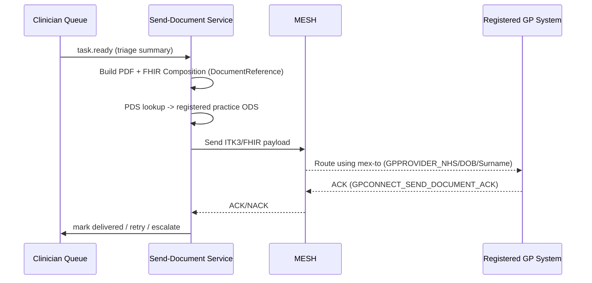
*(Why: Send Document uses MESH + ITK3; it’s a FHIR message to the registered practice.)* (NHS England Digital)

---

## 1) System Orchestrator (Event‑Driven Core)

**Purpose:** authenticate, authorize, normalize to FHIR, transact, enrich, route, and audit every event.

### 1.1 Inputs
- Any inbound event `e` on ingress topics, with `auth`, `idempotency_key`, `payload`.

### 1.2 Algorithm
<details>
<summary>View Orchestrator Algorithm</summary>

```pseudocode
Orchestrate(e):
  ctx := initContext(e)
  assert VerifySignatureAndReplayGuard(e.auth, e.id)          # zero-trust
  subj := ExtractSubject(e)                                   # patient/practitioner/system

  if !Authorize(subj.actor, e.action, subj.patient, e.scope): 
     EmitAudit("access_denied", e)
     return DENY

  if !CheckConsent(subj.patient, e.purpose, e.requested_resources):
     EmitAudit("consent_denied", e)
     return DENY

  R := NormalizeToFHIR(e.payload)                             # e.g., QuestionnaireResponse, Communication, Binary, etc.
  if !ValidateFHIRProfiles(R): 
     EmitAudit("invalid_fhir", e)
     return INVALID

  pId := ResolveMPI(R)                                        # match or create Patient
  LinkResourcesToPatient(R, pId)

  TxBegin()
    UpsertAll(R)                                              # atomic transaction (bundle)
  TxCommit()

  Enrich(R)                                                   # NLP coding, de-dup, linkages

  routes := DecideRoutes(e.topic, R)                          # publish to triage.*, booking.*, portal.notify, tasks.*, etc.
  Publish(routes)
  RecordMetrics(e, routes)
  EmitAudit("success", {e, R, routes})
  return OK
```

</details>
**Outputs:** Published events, persisted FHIR bundle, metrics, immutable audit.

Sequence (Orchestrate)
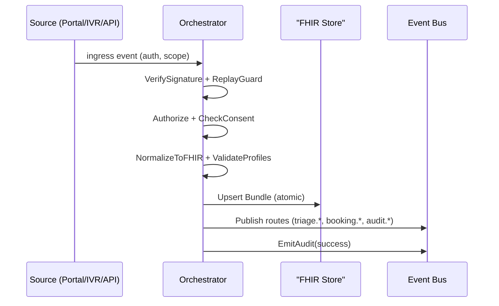

---

## 2) Access Front Door — Always‑On, Safe, Fair
Guarantees continuous access across web and phone (eliminates the "8am rush"), with safety gating and fairness.

### 2.1 Portal Uptime Guard (core‑hours compliance)
**Schedule:** Every minute per practice.  
**Goal:** Ensure portal is open within `CORE_HOURS`; display OOH banner outside.

<details>
<summary>View Portal Uptime Guard</summary>

```pseudocode
GuardPortal(practice):
  now := LocalTime(practice.tz)
  if isWithin(now, CORE_HOURS):
     if !PortalAlive(practice):
        AttemptReopen(practice.portal)
        Notify(practice.manager, "Portal reopened due to outage")
        EmitAudit("portal_reopened", practice)
  else:
     EnsureOOHBanner(practice.portal, advice="NHS 111, OOH service")
     if OOH_POLICY.accept_submissions:
        AcceptSubmissionsWithDeferral(practice.portal)       # queue for next-day triage
        ShowMessage(OOH_POLICY.patient_message)
     else:
        BlockSubmissionsWithAdvice(practice.portal)
```

</details>
**Outputs:** Portal state, incident notices, audit.

### 2.2 Urgent‑Safety Gate (transformer‑based red‑flag diversion)
**Trigger:** Immediately on submission (web or phone transcript).

<details>
<summary>View Urgent‑Safety Gate</summary>

```pseudocode
SafeguardGate(doc, patient):
  # 1) Semantic red‑flag detection via transformer NLP (BioBERT/ClinicalBERT or similar; multilingual if needed)
  nlp_results      := TransformerModel.analyze(doc)                 # structured extraction from text
  symptom_list     := nlp_results.symptoms                          # e.g., ["chest pain", "dizziness"] with context
  severity_list    := nlp_results.severity                          # e.g., descriptors, pain scores
  temporal_list    := nlp_results.temporal                          # e.g., onset/duration
  context_entities := nlp_results.context_entities                  # e.g., history of diabetes

  high_risk_symptom_flag := false
  for s in symptom_list:
    if SymptomLexicon.isRedFlag(s) && Confidence(nlp_results, s) >= Config.safety_gate.red_flag_threshold:
       high_risk_symptom_flag := true
       break

  # Optional redundancy: whole‑text emergency classifier
  if TransformerModel.classify_emergency(doc) >= Config.safety_gate.emergency_confidence:
     high_risk_symptom_flag := true

  # 2) Patient context integration (demographics + history)
  age          := patient.age
  comorbid     := patient.comorbidities

  # 3) Acuity prediction via ensemble ML model (e.g., gradient boosted trees)
  features := {}
  features["symptom_embeddings"] := ModelEmbedder.encode(symptom_list, severity_list, temporal_list)
  features["patient_age"]        := age
  features["patient_comorbid"]   := PatientVector.encode(comorbid)
  severity_prediction := AcuityModel.predict(features)              # "Emergency" | "Urgent" | "Routine"
  # Optionally threshold on emergency probability if available
  emer_prob := AcuityModel.predict_proba(features).emergency?

  # 4) Safety gate decision and diversion
  if high_risk_symptom_flag || severity_prediction == "Emergency" || (emer_prob && emer_prob >= Config.safety_gate.acuity_threshold_emergency):
     ShowUrgentAdvice(patient.locale)                               # localized 999/A&E or 111 guidance
     CreateSafetyAlert(doc, patient)
     EmitAudit("urgent_diversion", {doc, patient})
     return DIVERTED
  # Enforce timeout/fallback behaviour
  # If processing exceeded Config.safety_gate.timeout_ms and Config.safety_gate.fallback == "rules",
  # apply a rules-based check using RED_FLAG_SET as a last resort.
  if TimedOut():
     if Config.safety_gate.fallback == "rules" && ContainsAny(doc.text, Config.red_flag_set):
        ShowUrgentAdvice(patient.locale)
        CreateSafetyAlert(doc, patient)
        EmitAudit("urgent_diversion_fallback", {doc, patient})
        return DIVERTED
  return SAFE_TO_CONTINUE
```

</details>
**Outputs:** Patient urgent advice, Staff safety alert, audit (diverted) or pass‑through.

#### Model Choices & Performance
- Backbones: BioBERT/ClinicalBERT/BioClinicalBERT for symptom/entity NER; consider XLM-R/mBERT or translate-then-NER for multilingual input.
- Emergency classifier: lightweight transformer head or distilled LLM (e.g., MedAlpaca small). Calibrate with Platt/temperature; set `RED_FLAG_THRESHOLD` and `EMERGENCY_CONFIDENCE`.
- Acuity: gradient-boosted trees (e.g., XGBoost/LightGBM) over encoded symptoms + patient context. Calibrate thresholds for “Emergency”.
- Latency/throughput: target p50 < 300ms, p95 < 800ms. Use quantization (int8), batch small requests, prefer CPU inference where possible; GPU optional for bursts. Enforce `TIMEOUT_MS` with `FALLBACK="rules"` to maintain safety.
- Multilingual strategy: prefer native multilingual models when available; if translating, preserve clinical terms and run lexicon checks post-translation.
- Monitoring: log anonymized confidence + decisions, track false negatives, drift, and per-language performance; periodic offline evaluation and re-tuning.

### 2.3 Telephony Parity (cloud IVR → same digital flow)
**Input:** Inbound call.  
**Pipeline:**
1) Cloud telephony IVR greeting and intent capture (DTMF or free speech).  
2) **ASR** → transcript (up to N sec narrative).  
3) Caller ID / identity verification → map to `Patient`.  
4) **IntentClassifier** → {clinical, medication, admin, ...}.  
5) Build `doc` (same schema as web submission).  
6) **SafeguardGate(doc)**; if **DIVERTED** → urgent advice via IVR + alert.  
7) If safe → publish to `triage.input`; offer **callback windows** based on priority (from `CALLBACK_WINDOWS_BY_PRIORITY`).  
8) End call with confirmation.

Note: Aligns with NHS cloud telephony rollout (2025) and removes the “8am rush” by converting calls into the same digital triage queue as web.

```pseudocode
HandleCall(call):
  input := CaptureIntentAndNarrative(call)
  transcript := ASR(input.audio)
  patient := ResolveCallerIdentity(call.cli, transcript.prompts)
  intent := IntentClassifier(transcript.text)
  doc := BuildStructuredDoc(patient, intent, transcript, call.meta)

  if SafeguardGate(doc, patient) == DIVERTED: return END

  Publish("triage.input", doc)
  p := tentativePriorityFromEarlySignals(doc)
  OfferCallbackWindowsFromConfig(patient, p, Config.callback_windows_by_priority)
  if p == STAT and Config.telephony.emergency_transfer_enabled:
     OfferImmediateTransfer(to = LocalEmergencyNumber(patient.locale))
  return END
```

Sequence (Telephony Parity)
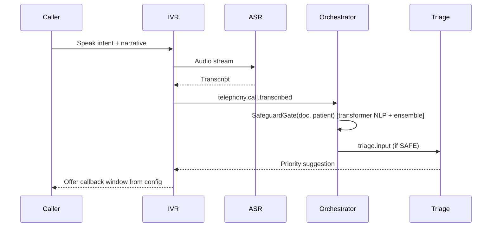

---

## 3) AI Triage, SLA Re‑prioritisation & De‑duplication

### 3.1 Unified Triage (web + phone + walk‑in)
<details>
<summary>View Unified Triage Algorithm</summary>

```pseudocode
Triage(doc):
  # Preliminary analysis of patient request
  intent          := IntentClassifier(doc.text)
  entities        := ClinicalNER(doc.text)                       # extract key symptoms/conditions for context (NER)
  riskFlags       := RiskClassifier(entities, doc.text)          # identify high-risk terms (e.g., red-flag symptoms)
  acuityScore     := AcuityModel(doc, doc.patient)               # ML-predicted acuity
  complexityScore := ComplexityModel(doc.patient)                # estimate complexity (e.g., multimorbidity)

  # Required skills and provider availability
  requiredSkills := SkillExtractor(intent, entities)             # infer needed clinician skills/role
  availableTeam  := QueryRotaAndSchedules(requiredSkills)       # on-duty providers with matching skills & capacity

  # Composite priority scoring (higher = more urgent)
  riskWeight  := riskFlags.weight
  timeFactor  := TimeDecay(now() - doc.created_at)               # increase score over time (SLA aging)
  capacityGap := CapacityGap(requiredSkills, availableTeam)      # demand-supply gap for skill
  # Weights from config (triage.score_weights)
  w := Config.triage.score_weights
  score := w.acuity*acuityScore + w.risk*riskWeight + w.complexity*complexityScore + w.time*timeFactor - w.capacity*capacityGap

  if IsLifeThreatening(riskFlags, acuityScore):
     CreateSafetyAlert(doc.patient)
     EmitAudit("life_threat_override", doc)
     priorityLabel := "stat"
  else:
     priorityLabel := MapPriority(score, Config.priority_thresholds)   # STAT / URGENT / SOON / ROUTINE

  # Assign to best-suited clinician (skill match, continuity, workload balance)
  owner := SelectBestProvider(availableTeam, doc.patient, requiredSkills, priorityLabel)
  task  := CreateFHIRTask(doc, owner, priorityLabel)            # FHIR Task for patient, with assignee and priority
  Persist(task)
  NotifyOwnerQueue(owner, task)
  return task
```

</details>
**Outputs:** `Task` in clinician queue, owner/team notification, audit.

Sequence (Triage and Aging)
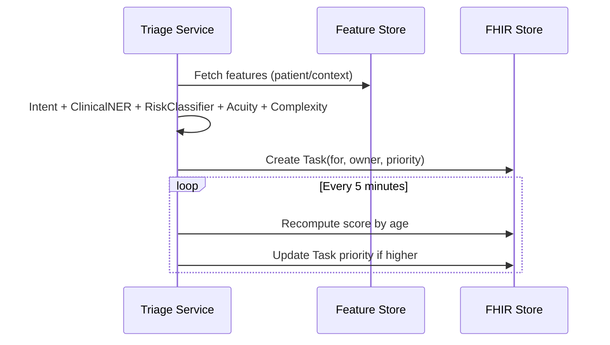

### 3.2 SLA Re‑prioritisation (aging)
**Schedule:** Every `Config.triage.aging_interval` (default PT5M).
<details>
<summary>View SLA Re‑prioritisation (Aging)</summary>

```pseudocode
AgeOpenTasks():
  # Re-run on configured interval, factoring live capacity (monotonic aging)
  for t in OpenTasks(status in {requested, ready}):
    # Refresh availability for required skills
    req := SkillExtractor(IntentClassifier(t.doc.text), ClinicalNER(t.doc.text))
    team := QueryRotaAndSchedules(req)
    capGap := CapacityGap(req, team)
    # Recompute score using same weights, updated age and capacity
    w := Config.triage.score_weights
    wf := RiskClassifier(ClinicalNER(t.doc.text), t.doc.text).weight
    td := TimeDecay(now - t.created_at)
    acu := AcuityModel(t.doc, t.doc.patient)
    cpx := ComplexityModel(t.doc.patient)
    score' := w.acuity*acu + w.risk*wf + w.complexity*cpx + w.time*td - w.capacity*capGap
    newLabel := MapPriority(score', Config.priority_thresholds)
    if Higher(newLabel, t.priority):
       UpdateTaskPriority(t, newLabel)
       NotifyOwnerQueue(t.owner, t, reason="SLA aging")
```

</details>
**Guarantees:** Monotonic escalation; audited.

### 3.3 Cross‑Channel De‑duplication
<details>
<summary>View Cross‑Channel De‑duplication</summary>

```pseudocode
Deduplicate(doc, window=Config.triage.dedup_window, tau=Config.triage.sim_threshold):
  recents := FetchPatientRequests(doc.patient, last=W)
  for d in recents:
    if Similarity(doc, d) >= tau:
       MergeIntoTask(d.task, extraInfo=doc)    # annotate, do not create new task
       EmitAudit("dedup_merge", {doc -> d.task})
       return MERGED
  return DISTINCT
```

</details>

---

## 4) Booking — Search & Assisted (MVP) + GP Connect

### 4.1 Search & Rank
<details>
<summary>View Search & Rank</summary>

```pseudocode
SearchAndRankAppointments(request):
  intent := DetermineAppointmentType(request)                 # GP, nurse, phlebotomy...
  sources := [localPractice] + PCNPartners + Hubs             # federated sources
  S := {}
  for src in sources:
    S += FHIR_SlotSearch(src, serviceType=intent, window=request.window)

  prefs := FetchPatientPrefs(request.patient)                 # e.g., female clinician, wheelchair access, language
  for s in S:
    tt   := TravelTime(request.patient.addr, s.location)
    cont := ContinuityScore(request.patient, s.practitioner or org)
    util := UtilizationGoalWeight(s)                          # e.g., encourage EA usage
    lang := InterpreterFeasibility(prefs.language, s.location or s.site)
    access := AccessibilityFit(prefs, s.location or s.site)   # wheelchair access, BSL availability
    s.rank_score = R1*PrefScore(prefs, s) - R2*tt + R3*cont + R4*util + R5*lang + R6*access
  return TopK(sortDesc(S, by=rank_score), k=5)
```

</details>
**Outputs:** Ranked options (typically top 3–5) for patient/clinician choice.

### 4.2 Assisted booking (MVP)
- **Console experience:** Surface the ranked recommendations (top 3–5 windows) with context, travel fit, and fairness indicators. Provide a **“Book in clinical system”** call-to-action when the care team confirms a slot in EMIS/TPP/SystemOne.  
- **State updates:** On confirmation, persist a local `Appointment` (status=`booked`) linked to the originating `Task`, capture the booked window, and record whether the patient accepted/declined.  
- **Task lifecycle:** Close the task with outcome metadata (`booked`, `no suitable time`, `pharmacy referral sent`) and emit the relevant audit + event (`booking.assisted.completed`).  
- **Retry/updates:** Allow the task to remain open with a note if staff cannot secure a slot, keeping it on the waitlist view for follow-up.

```pseudocode
AssistedBook(task, recommendation, staffOutcome):
  options := SearchAndRankAppointments(task.request)
  ShowTopK(options, k=5)
  if staffOutcome == "booked":
     appt := RecordLocalAppointment(task.patient, recommendation.slot, status="booked")
     CloseTask(task, outcome="booked", appointment=appt)
  elif staffOutcome == "no_time":
     LogAttempt(task, note="No suitable time in clinical system")
     ReturnToQueue(task)
  elif staffOutcome == "pharmacy_referral_sent":
     UpdateTask(task, status="completed", outcome="pharmacy_referral")
  EmitAudit("booking.assisted", {task, staffOutcome})
  PublishEvent("booking.assisted.completed", {task.id, staffOutcome})
```

### 4.3 GP Connect autobooking (future)
> Guarded by `FEATURE_GP_CONNECT_BOOKING=false` until national booking APIs mature and practices opt in.

<details>
<summary>View Federated Booking</summary>

```pseudocode
FederatedBook(slot, patient, reason):
  if !FeatureFlags.gp_connect_booking:
     return FEATURE_DISABLED
  if !EligibilityCheck(slot.org, patient): return INELIGIBLE
  appt := BuildFHIRAppointment(slot, patient, reason)         # status=booked, participants
  if !GPConnectCreate(slot.org, appt): return CONFLICT_OR_FAIL
  SendConfirmation(patient, appt)                              # SMS/app/email
  WriteBackToRecord(patient, appt)
  return BOOKED(appt)
```

</details>

Sequence (Booking via GP Connect — feature-flagged)
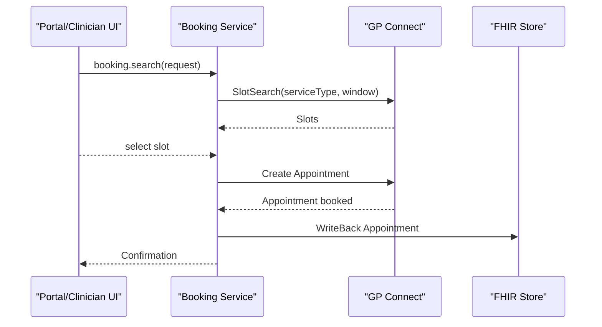

---

## 5) Pharmacy First Router (minor ailments deflection)
*Pharmacy → GP writeback occurs natively inside GP systems; OneCare listens for the outcome and closes the originating Task. No onboarding for Update Record is required.*

### 5.1 Condition Classification & Eligibility
<details>
<summary>View Pharmacy First Router</summary>

```pseudocode
PharmacyFirstRoute(doc, patient):
  cond := SymptomToCondition(doc)                             # sore throat, UTI, impetigo, etc.
  if !EligibleForPharmacyFirst(cond, patient, rules):         # age/sex/severity/exclusions
     return NOT_ELIGIBLE

  options := FindNearbyPharmacies(patient.postcode, cond)     # capacity/booking availability
  slot := BestPharmacyOption(options)
  if slot == NONE:
     # Some CPCS flows accept slotless electronic referrals (pharmacy contacts patient)
     if CPCSSupportsSlotlessReferral():
        sr := CreateFHIRServiceRequest(patient, category="pharmacy-first", reason=cond)
        ok := SendCPCSReferral(nearestPharmacy(options).org, sr, doc.summary)
        NotifyPatientPharmacyReferral(patient, nearestPharmacy(options), cond)
        return BOOKED_PHARMACY(nearestPharmacy(options), sr)
     return NO_PHARMACY_SLOTS

  sr := CreateFHIRServiceRequest(patient, category="pharmacy-first", reason=cond)
  ok := SendCPCSReferral(slot.org, sr, doc.summary)
  NotifyPatientPharmacyReferral(patient, slot, cond)
  return BOOKED_PHARMACY(slot, sr)
```

</details>

Flow (Pharmacy First)
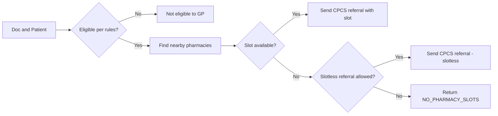
### 5.2 Outcome Write‑back
- Listen for pharmacy outcome → ingest as `Observation` / `Condition` / `MedicationRequest` + update/close original `Task`.  
- If escalated by pharmacist → create **urgent** `Task` for GP.

---

## 6) Capacity Shaper & Access Co‑Pilot

### 6.1 Forecasting & Micro‑Releases
**Schedule:** ~ every 15 minutes.
```pseudocode
ShapeCapacity():
  telem := CollectTelemetry()                     # queue depth, arrivals/hr, no-shows, staffing
  forecast := ShortHorizonForecast(telem, H=4h)
  need  := NeedMix(telem.openTasks + forecast)    # urgent/soon/routine/admin
  supply:= SupplyMix(currentSlots, staffRota)
  delta := need - supply

  if Significant(delta, eps):
     ReleaseHeldBackSlots(HOLD_BACK_FRACTION, target=delta)   # convert slot types if needed
     RebalanceTemplatesSafely()                               # preserve urgent floor
     EmitAudit("micro_release", delta)
```
### 6.2 Access Co‑Pilot (human‑in‑the‑loop optimizer)
```pseudocode
AccessCoPilot():
  state := ObserveKPIsAndRisks()                  # SLA breach risk, utilization, continuity, fairness
  actions := {
    SwapSlotTypes, ExtendCallbacks, ReassignStaff,
    FederateToPCN, IncreasePharmacyRouting, ...
  }
  best := NONE; bestU := -inf
  for a in actions:
    if GuardrailsOk(a, state):
       U := ProjectUtility(a, state)              # expected KPI improvement
       if U > bestU: best := a; bestU := U

  if best != NONE:
     ProposeToManager(best, rationale, projectedImpact)
     if ManagerApproves(best):
        Apply(best); EmitAudit("copilot_apply", best)
```
**Outputs:** Released slots, template adjustments, approved operational changes.

Flow (Capacity Shaping)
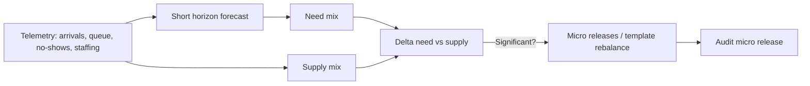

---

## 7) Ambient Scribe & Summarisation (safety‑first)

### 7.1 Capture → Draft → Commit
```pseudocode
AmbientScribe(encounter):
  # 0) Explicit consent from both parties
  if !(Consent(encounter.patient) && Consent(encounter.clinician)):
     return DISABLED

  # 1) Capture and transcribe the clinician‑patient conversation with diarization
  audio       := encounter.getAudioRecording()
  ASR_model   := LoadASRModel(Config.ambient_scribe.asr_model)
  transcript  := ASR_model.transcribe(audio, diarize=Config.ambient_scribe.asr_diarization)
  speakers    := transcript.speaker_labels

  # 2) Summarize and extract key clinical information using a medical‑grade LLM
  LLM_model  := LoadLLM(Config.ambient_scribe.llm_model)
  draft_note := LLM_model.summarizeToSOAP(transcript.text, speakers=speakers,
                                          highlight_uncertainty=Config.ambient_scribe.uncertainty_highlight)
  # Ensure end-to-end scribe processing completes within Config.ambient_scribe.timeout_ms or fallback
  entities   := LLM_model.extractEntities(draft_note)         # conditions, observations, medications, care plan

  # 3) Construct FHIR draft resources based on recognized entities, linking to Encounter/Patient
  docRef := FHIR.DocumentReference(content=draft_note,
                                   type="clinical-note",
                                   encounter=encounter.id,
                                   subject=encounter.patient.id, status="draft")
  conditions := []
  for condition_text in entities.conditions:
    code := Terminology.mapToCode(condition_text, system="SNOMED-CT")
    condRes := FHIR.Condition(code=code, subject=encounter.patient.id,
                              encounter=encounter.id, verificationStatus="unconfirmed")
    conditions.append(condRes)

  observations := []
  for (obs_text, obs_value) in entities.observations:
    code := Terminology.mapToCode(obs_text, system="SNOMED-CT")
    obsRes := FHIR.Observation(code=code, value=obs_value,
                               subject=encounter.patient.id, encounter=encounter.id)
    observations.append(obsRes)

  medications := []
  for (med_name, med_dose) in entities.medications:
    med_code := Terminology.mapToCode(med_name, system="dm+d")
    medRes := FHIR.MedicationRequest(medication=med_code, dosage=med_dose,
                                     subject=encounter.patient.id, encounter=encounter.id)
    medications.append(medRes)

  care_plan := null
  if entities.care_plan_actions:
    care_plan := FHIR.CarePlan(activities=entities.care_plan_actions,
                               subject=encounter.patient.id, encounter=encounter.id)

  draft_resources := [docRef] + conditions + observations + medications + (care_plan ? [care_plan] : [])

  # 4) Human‑in‑the‑loop review: present the draft note and resources for clinician approval/editing
  highlights := LLM_model.getUncertaintySpans(draft_note)     # low‑confidence or inferred sections
  UI.displayDraftNote(draft_note, linkedTranscript=transcript, highlights=highlights)
  UI.displayDraftResources(draft_resources)
  clinician_action := UI.promptClinicianReview()              # "approve" | "edit" | "reject"

  if clinician_action == "edit":
    draft_note       := UI.getEditedNote()
    draft_resources  := UI.getEditedResources()               # optional: regenerate entities
    clinician_action := UI.promptClinicianReview()

  if clinician_action == "reject":
    # 5) Fallback: if LLM draft is declined or unavailable, use transcript or template‑based note
    if Config.ambient_scribe.fallback_mode == "transcript" || draft_note == null || LLM_model.failed:
       draft_note := FormatUtils.transcriptToNote(transcript)
    else if Config.ambient_scribe.fallback_mode == "template":
       draft_note := TemplateUtils.blankSOAPNote(transcript)
    else:
       draft_note := FormatUtils.transcriptToNote(transcript)
    docRef.content := draft_note
    UI.displayDraftNote(draft_note, linkedTranscript=transcript)
    clinician_action := "approve"                               # assume manual completion

  # 6) On approval, finalize the documentation and commit to FHIR store
  if clinician_action == "approve":
    docRef.status := "final"
    for resource in draft_resources:
      if resource != docRef:
        if HasField(resource, "verificationStatus"): resource.verificationStatus := "confirmed"
        if HasField(resource, "status"):             resource.status := "final"
      FHIR.store(resource)
    ASR_version := ASR_model.version
    LLM_version := LLM_model.version
    EmitAudit("scribe_committed", {encounterId: encounter.id, ASR_model: ASR_version, LLM_model: LLM_version})

  return docRef
```
**Outputs:** Finalised clinical note + structured entries; immutable audit.  
**Fallbacks:** Provide raw transcript or template if AI unavailable.

Sequence (Ambient Scribe)
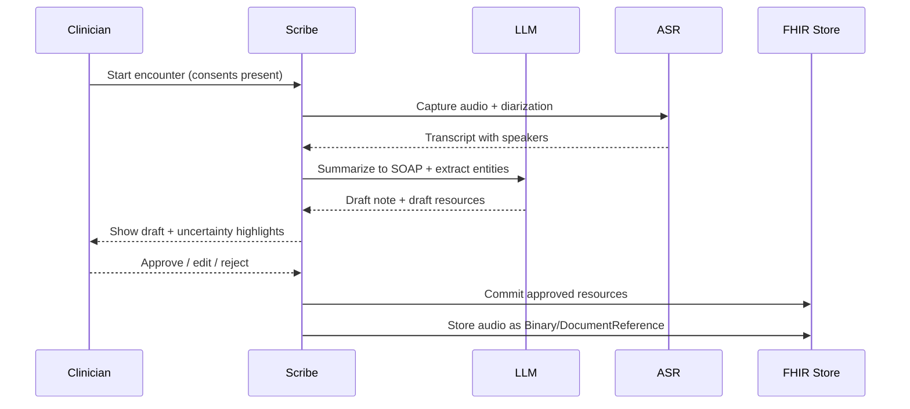

#### Model Choices & Performance
- ASR: Whisper large‑v3 medical or equivalent; target WER ≤ 12% clinical, DER ≤ 10% for diarization; ensure PII redaction on export.
- LLM: MedPaLM2/OpenClinicalGPT/BioGPT; enforce uncertainty highlighting and cite‑from‑transcript style to reduce hallucinations.
- Terminology: SNOMED‑CT for conditions/observations; dm+d for medications (UK); log unmapped terms for curation.
- Latency: draft within 60s p95; stream partial drafts when >10s; enforce SCRIBE.TIMEOUT_MS with graceful fallback.
- Human‑in‑the‑loop: mandatory approval; edits overwrite AI content; store provenance (model versions) with Audit.
- Evaluation: periodic offline eval on de‑identified datasets (SOAP quality, entity precision/recall, safety incidents); canary rollouts for new models.

---

## 8) Workflow Automation (Docs, Repeats, Recalls)

### 8.1 Document Automation (letters, PDFs, faxes)
```pseudocode
OnDocumentReferenceCreated(docRef):
  if IsImageOrScanned(docRef): text := OCR(docRef)
  dtype := ClassifyDocument(text)                              # discharge, consultant letter, labs...
  key := ExtractKeyData(dtype, text)                           # dx/procedures/med changes/follow-up
  patient := ResolveFromDoc(text or metadata)
  suggestions := SuggestActionsFromKey(dtype, key)
  tasks := CreateTasksAndDrafts(patient, suggestions)
  RouteTasksByType(tasks)
```
### 8.2 Repeat Prescriptions (safety‑first, human sign‑off)
```pseudocode
HandleRepeatRequest(req, patient):
  if !OnRepeatList(req.med) || ExpiredAuthorization(req.med): return ROUTE_TO_REVIEW
  if TooEarly(req) || MonitoringDue(patient, req.med):        return ROUTE_TO_REVIEW
  if AllergyOrInteractions(patient, req.med) or AbnormalRecentLabs(patient, req.med):
     return ROUTE_TO_GP

  draft := DraftMedicationRequest(req, patient)
  task := CreateAuthTask(draft, role in {Pharmacist, GP})
  OnHumanSignOff(task): IssueEPSPrescription(draft)
```
### 8.3 LTC Recalls (demand smoothing)
```pseudocode
NightlyLTCJob():
  cohorts := BuildOverdueCohorts()                             # diabetes/asthma/COPD/...
  plan := SpreadOverWeeks(cohorts, clinicCapacity)
  for p in plan:
    AutoScheduleOrInvite(p.patient, p.clinic, p.week)
    CreateRecallTasks(p)
```

---

## 9) ICS Hub — Cross‑Org Tasks, Access Exchange, Smart Waitlist

### 9.1 Cross‑Org Referral & Task Mirrors
```pseudocode
CreateCrossOrgReferral(patient, fromOrg, toOrg, reason, attachments):
  sr := FHIR.ServiceRequest(patient, reason, toOrg)
  t  := FHIR.Task(assignee=toOrg, basedOn=sr)
  bundle := Bundle(sr, t, attachments)
  SecureShare(toOrg, bundle)                                   # FHIR, MESH/XDS, etc.
  SubscribeTaskUpdates(t)                                      # mirror status back
  return t
```
### 9.2 Access Exchange (PCN/ICS marketplace)
```pseudocode
AccessExchange():
  spare := AggregateOpenSlots(network, horizon=48h)
  waiters := CollectWaitingPatientsWithPriorityAndPrefs()
  matches := Match(waiters, spare, criteria=[need, continuity, distance, fairness])
  for (w, s) in matches:
     FederatedBook(s, w.patient, reason=w.reason)
     NotifyHomePractice(w.patient, s)
```
### 9.3 Smart Waitlist (auto‑fill cancellations)
```pseudocode
OnAppointmentCancelled(slot):
  candidates := FilterWaitlistByTypeAndFeasibility(slot)
  ordered := Rank(candidates, by=[need, continuityToClinician(slot), distance, fairness])
  OfferSequentialOrBatch(ordered, slot, ttl=30min)
  OnFirstAccept(): ConfirmBooking(slot, patient)
  ExpireOthers()
  if StartImminent(slot, within=15min) and NoAccepts():
     MarkAsOpenForWalkInsOrLastMinuteCalls(slot)
```

Sequence (Cross‑Org Referral)


---

## 10) Compliance & Assurance (contracts, KPIs, reports)

### 10.1 Live KPIs (examples)
- **Portal Uptime (core hours)**  
- **Median Time‑to‑First‑Response** (by category)  
- **Callback SLA Hit Rate** (STAT/URGENT/SOON/ROUTINE)  
- **Enhanced Access Utilisation**  
- **Pharmacy Diversion Rate**  
- **Fairness Floors Met** (parity across channels/cohorts)  
- **Continuity Score**

Notes: Example defaults from the report include URGENT contact within 2 hours and ROUTINE initial response within 48 hours; these feed SLA hit‑rate tracking and the aging/escalation logic.

### 10.2 Reporting
- **Hourly dashboards:** practice / PCN / ICS views.  
- **Monthly Access Assurance Pack:** trends, breaches, mitigations, Co‑Pilot decisions, signatures.  

 

---

## 11) Identity, Authorization, Consent & Safety Gates
*Patient-facing modules never call GP Connect directly. All GP Connect interactions stay staff-side and, for Send Document, are application-restricted via MESH with local RBAC enforcing access.* (NHS England Digital)

### 11.1 Authorization = RBAC + Relationship + ABAC + Purpose-of-Use
<details>
<summary>View Authorization</summary>

```pseudocode
Authorize(actor, action, subject, scope):
  if !RBAC(actor.role, action): return false
  if !HasRelationshipOrBreakGlass(actor, subject.patient): return false
  if !ABAC_OK(actor, subject, scope): return false           # sensitivity, time, device, location
  return true
```

</details>
### 11.2 Consent & Break‑Glass
<details>
<summary>View Consent & Break‑Glass</summary>

```pseudocode
CheckConsent(patient, purpose, resources):
  rules := FetchActiveFHIRConsent(patient)
  return EvaluatePurposeAndScopes(rules, purpose, resources)
```

</details>
Break‑glass grants emergency access w/ reason, heavy audit, post‑hoc review.

### 11.3 Clinical Safety Gates
- **Transformer‑based red‑flag diversion** (pre‑triage via SafeguardGate: NER + emergency classifier + ensemble acuity).  
- **Human confirmation** of AI outputs (triage assignments, patient advice, scribe).  
- **Communication guardrails** (plain language, safety‑netting).  
- Safety case & hazard log (DCB0129/0160).

### 11.4 Communication Guardrails (patient‑facing advice)
```pseudocode
ComposePatientAdvice(draft, locale):
  msg := UsePlainLanguage(draft, reading_age=9)
  msg := AvoidDefinitiveDiagnosis(msg)                        # suggest possibilities, not certainties
  msg := AddSafetyNetting(msg, "If symptoms worsen, contact us or emergency services.")
  msg := LocalizeUrgentNumbers(msg, locale)                   # e.g., 999/A&E, NHS 111
  return msg
```

---

## 12) Security, Privacy, Audit & Observability

### 12.1 Security & Minimization
- **Encryption** at rest (tenant‑scoped keys) and in transit (TLS).  
- **Zero‑trust** between services; least privilege.  
- **Field redaction / query rewriting** per role/consent.  
- **Data minimization & retention**; analytics de‑identification.  
- **Regular penetration testing** and full **DSPT** compliance.

### 12.2 Immutable Audit (WORM) + SIEM
<details>
<summary>View Immutable Audit</summary>

```pseudocode
EmitAudit(action, obj):
  rec := { action, actor, subject, resources, ts, outcome, model_ver? }
  AppendWORM(rec); StreamToSIEM(rec); AnomalyDetect(rec)
```

</details>
### 12.3 Observability & Resilience
- SLOs: triage p95 < 2s; scribe draft < 60s; portal p99 < 300ms.  
- Backpressure & circuit breakers; graceful degradation (rule‑based fallbacks).  
- Health dashboards & alerting; cache for reads; queues for writes during connector outages.  
- All events carry correlation and causation IDs end‑to‑end for traceability across services and audit.

---

## 13) MLOps & Governance

### 13.1 Lifecycle
<details>
<summary>View MLOps Lifecycle</summary>

```pseudocode
ModelLifecycle(model):
  data := CurateDeidentifiedTrainingData(FeatureStore, window=6-12m)
  v := Train(model, data)
  eval := Evaluate(v, sets=[in-domain, OOD, fairness]); if !PassSafety(eval): STOP
  Register(v, model_card, lineage, metrics)
  CanaryDeploy(v, pct=5%) -> Monitor(latency, agreement, outcomes, bias, drift)
  if Stable(): PromoteTo100% else: Rollback()
```

</details>
### 13.2 Explainability & Feedback
- Log inputs/outputs (hashed identifiers), prompt/response archives for LLMs.  
- SHAP/LIME explanations for predictive models.  
- Clinician disagreement feedback loops; outcome‑based learning; fairness monitoring.

---

## 14) Failure Modes & Fallbacks (fail-safe)

- **Send Document ACK delay:** If no ACK within `ack_timeout_minutes`, retry with exponential backoff up to `max_retries`; after that, raise a worklist alert and permit NHSmail fallback per site policy.
- **Duplicate message protection:** Enforce idempotency via `DocumentReference.identifier` and unique `mex-localid` values when sending to MESH.
- **Routing failures:** Re-check NHS number/DOB/surname formatting, refresh the registered practice via PDS lookup, and rebuild the MESH headers before retrying.
- **ASR down:** route to receptionist/voicemail; store audio; later transcription; manual notes UI.  
- **LLM unavailable:** show raw transcript; template summaries; rule-based triage.  
- **ML triage scoring unavailable:** fall back to config-driven rules (`triage.fallback`). Reuse `triage.score_weights` + `priority_thresholds`, scan narrative for `config.red_flag_set` to force `STAT/URGENT`, emit reason codes (`rule:red_flag:*`, `rule:fallback:*`), and return a decision within `time_budget_ms`.  
- **Connector outage (e.g., GP Connect):** cache reads, queue writes, inform users; retry on recovery.  
- **High-risk with no capacity:** auto-escalate to on-call/PCN/OoH; advise patient to 111/A&E; management alert.  
- **Portal down in hours:** auto-restart, incident alert, contingency message; recorded in uptime KPI.  
- **Infra/data incidents:** backups, failover; emergency mode for demand surges.
- **Mass demand surge (e.g., winter pressures/pandemic):** broadcast delay messaging, expand callback windows per `CALLBACK_WINDOWS_BY_PRIORITY`, adjust templates while preserving urgent floors; notify PCN/ICS for mutual aid.
- **OOH handover:** when outside core hours and high-risk cases occur, perform warm handover to local out-of-hours provider (with consent or emergency basis) and inform patient with instructions (111/AE as appropriate).

---

## Appendix A — Priority Mapping (monotonic)

<details>
<summary>View Priority Mapping</summary>

```pseudocode
MapPriority(score, thresholds):
  if score >= thresholds.stat:   return "stat"
  if score >= thresholds.urgent: return "urgent"
  if score >= thresholds.soon:   return "soon"
  return "routine"
```

</details>
**Constraints:**  
1) Higher clinical acuity never lowers score.  
2) Life‑threatening → **STAT** override.  
3) Time since submission only increases priority (aging).

---

## Appendix B — Continuity & Fairness‑Aware Assignment
<details>
<summary>View Continuity & Fairness Assignment</summary>

```pseudocode
SelectBestProvider(availableTeam, patient, requiredSkills, priorityLabel):
  candidates := FilterBySkills(availableTeam, requiredSkills)
  w := Config.provider_assignment.weights
  best := argmax_c in candidates of (
    w.availability*Availability(c)                    # current capacity / queue
  - w.workload*Workload(c)                            # workload balance
  + w.continuity*Continuity(patient, c)               # preferred/seen-before GP weighting
  + w.resolution_rate*ResolutionRate(c, requiredSkills)
  - w.distance*Distance(patient, c.site)              # if site matters
  + w.fairness*FairnessBoost(patient.needs, c.capabilities, priorityLabel)
  )
  return best
```

</details>

---

## Appendix C — Minimal API Surface (illustrative)

```
POST /portal/submissions            -> creates FHIR QuestionnaireResponse/Communication; emits triage.input
GET  /clinician/tasks               -> query FHIR Task for team/owner/status
POST /booking/search                -> federated search (Slot search)
POST /booking/federated             -> GP Connect book Appointment
POST /messaging/send-document       -> packages ITK3 payload, sets MESH headers, sends PDF + bundle, returns messageId
POST /pharmacy/route                -> Pharmacy First evaluation + referral
POST /copilot/proposal/apply        -> manager approval to apply action
GET  /compliance/kpis               -> KPI dashboard feed
```
All endpoints enforce authZ + consent; outputs filtered by policy.

---

## Appendix D — Configuration Summary
- **Hours & windows:** `CORE_HOURS_*`, `ENHANCED_ACCESS_WINDOWS`  
- **Safety:** `RED_FLAG_SET`, `PRIORITY_THRESHOLDS`, `SLA_TARGETS`, `SAFETY_GATE.*`  
- **Scribe:** `SCRIBE.*`  
- **Capacity:** `HOLD_BACK_FRACTION`  
- **Equity:** `FAIRNESS_FLOORS`  
- **Privacy & retention:** `PRIVACY_POLICY`
 - **Triage & Aging:** `triage.*` (score_weights, aging_interval, sim_threshold, dedup_window)  
 - **Provider Assignment:** `provider_assignment.*` (weights for availability/workload/continuity/resolution/distance/fairness)  
 - **Telephony:** `telephony.*` (IVR classifier, callbacks, emergency transfer toggle)  
 - **Observability & SLOs:** `observability.slo.*`, `observability.alerts.*`

---

## Appendix E — Event Topics (examples)
- `portal.submission.created`, `telephony.call.transcribed`, `triage.input`, `tasks.created`  
- `booking.search.requested`, `booking.assisted.completed`, `booking.appointment.booked`, `pharmacy.referral.sent`  
- `messaging.senddoc.requested`, `messaging.senddoc.sent`, `messaging.senddoc.ack`, `messaging.senddoc.nack`, `messaging.senddoc.retry`  
- `copilot.proposal.created`, `copilot.proposal.approved`, `analytics.kpi.updated`, `audit.*`  
- `ooh.handover.sent`, `ooh.handover.ack` (out-of-hours warm handover lifecycle)
- `safeguard.diverted`, `safeguard.safe` (outcomes of SafeguardGate)
- `scribe.draft.created`, `scribe.finalized`, `scribe.fallback.used` (ambient scribe lifecycle)

Event Topics Map (illustrative)
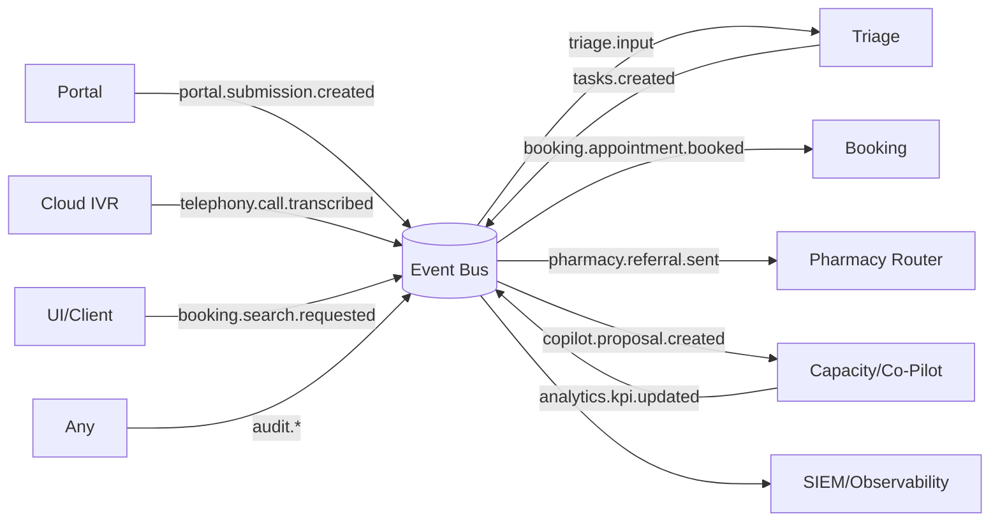

---

## Appendix F — Data Contracts (selected FHIR elements)

**Task**  
`status`, `priority`, `for(Reference:Patient)`, `owner(Reference:Practitioner/Org)`, `input(References)`, `authoredOn`, `reasonCode`, `basedOn`.  

**Appointment**  
`status`, `slot(Reference:Slot)`, `start`, `end`, `participant[Patient, Practitioner, Location/Service]`, `reasonCode/description`.  

**ServiceRequest**  
`status`, `intent`, `subject(Patient)`, `code/category`, `reasonCode`, `authoredOn`, `requester`, `performer`.  

**DocumentReference/Binary**  
`type`, `subject`, `content(attachment:url/mediaType/hash)`, `context(encounter)`.  

**Consent**  
`status`, `scope(purpose)`, `provision(type, actor, action, data, purpose)`.

---

## Appendix G — SLOs & Alerts (examples)
- **Triage** p95 < 2s; alert if p95 > 2s for 5m.  
- **Scribe draft** < 60s; alert if queue backlog > N.  
- **Portal** p99 < 300ms; uptime ≥ 99.9% core hours.  
- **Audit** end‑to‑end correlation coverage = 100%.
- **Fairness** telephone fraction ≥ 15% daily; alert if below floor.  

---

## Sources (from original report)
NHS Enhanced Access DES; Pharmacy First service; GP Connect Appointment Management; 24/7 digital access exemplars; NHS guidance on AI ambient scribing; NHS Clinical Safety Standard DCB0129/DCB0160; continuity of care and access equity considerations.

---

## Glossary
- FHIR: HL7 Fast Healthcare Interoperability Resources standard
- GP Connect: NHS interface for cross-org appointment booking and data access
- CPCS: Community Pharmacist Consultation Service (Pharmacy First referrals)
- PCN: Primary Care Network
- OOH: Out-of-hours provider/service
- SIEM: Security Information and Event Management system
- WORM: Write Once Read Many (immutable storage)

## Implementation Notes — Send Document Rollout
- **A) Build “Send Document v2.0” service**
  - Compose payload with the existing PDF triage summary + FHIR `Composition`/`DocumentReference` bundle wrapped in ITK3 v2.0 headers.
  - Set MESH headers (`mex-to`, `mex-workflowid`, `mex-subject`, `mex-localid`) using NHS number, DOB (YYYYMMDD), and surname per guidance.
  - Always route to the registered practice after a PDS lookup; treat business + technical ACKs and update the originating `Task`.
  - On NACK, surface the reason, retry per config, and escalate if exhausted.
- **B) Config (new keys)**
  - Populate `messaging.send_document.mesh.*` values, `ack_timeout_minutes`, `max_retries`, and `backoff_schedule`.
  - Enable `messaging.send_document.pds_lookup` and enforce `pdf_max_mb` limits aligned with receiver constraints.
  - Keep `feature_flags.gp_connect_booking = false` until practices approve autobooking.
- **C) Assisted booking UI**
  - Show the ranked Top 3–5 windows with contextual cues.
  - Provide quick actions: “Booked in EMIS/TPP”, “No suitable time”, “Pharmacy referral sent”.
  - When marked “Booked”, create/update the local FHIR `Appointment` and close the task with audit + notifications.
- **D) Onboarding steps (parallel work)**
  - Submit the NHS use case form and request Path to Live access for Send Document.
  - Secure the MESH mailbox, complete ITK3 conformance, and prepare DCB0129/0160 safety case evidence.
  - Schedule sender testing with NHS England Digital before go-live.

## Developer Notes
- Pseudocode convention: TitleCase functions with explicit inputs/outputs; side-effects publish to `Event Bus` and persist to `FHIR` atomically where relevant.
- All patient data is FHIR-first; binaries are stored via `Binary`/`DocumentReference` with hash and mediaType.
- Every externally visible change emits an event and an immutable audit record with correlation/causation IDs.
- Safety gates precede AI decisions; any AI suggestion with clinical impact requires human confirmation.
- Config is environment/tenant scoped; defaults shown in the YAML example should be overridden per practice/PCN.
- Use the Event Topics Map and Sequences to locate producer/consumer responsibilities quickly when implementing services.
